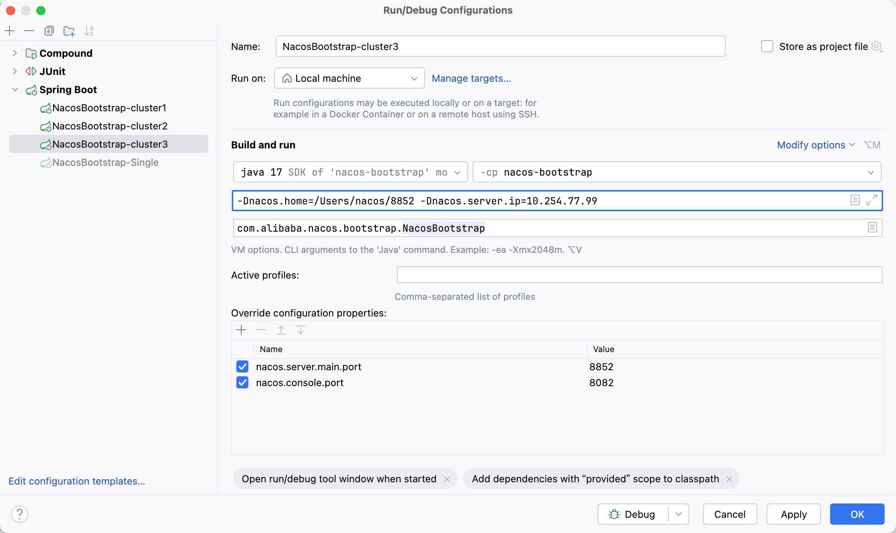

- 启动类：com.alibaba.nacos.bootstrap.NacosBootstrap

### 单机启动

1. 添加 VM 参数：-Dnacos.standalone=true
2. 创建表：distribution/conf/mysql-schema.sql
3. 生效的日志配置文件：core/src/main/resources/META-INF/logback/nacos.xml

### 集群启动

控制台执行以下命令：

```shell
ifconfig | grep "inet " | grep -v 127.0.0.1
```

获取本机真实的 IP 地址，这个 IP 地址用于配置 Nacos 的集群的 IP:PORT。

接下来在 IDEA 中添加三个 nacos 实例的启动配置，并添加上以下参数：



- VM: `-Dnacos.home=/Users/nacos/8852 -Dnacos.server.ip=10.254.77.99`

其中 server ip 即为执行命令时获取到的 IP

- nacos.server.main.port: Nacos Server 端口
- nacos.console.port: Nacos 控制台端口

配置上以上内容后，可以先尝试启动一下（会启动失败），目的是能够在配置的 `nacos.home` 目录下生成 `conf` 和 `logs` 目录，在下面创建名称为 `cluster.conf` 的文件，内容如下：

```text
10.254.77.99:8848
10.254.77.99:8850
10.254.77.99:8852
```

并且需要在 `resources/application.properties` 添加配置：

```properties
nacos.core.auth.server.identity.key=nacos_fy
nacos.core.auth.server.identity.value=nacos_fy
```

这样 Nacos Server 会和其他的 Server 创建 gRPC 连接，文件都创建好之后再次启动，集群就部署成功了。为了启动方便，可以在 IDEA 启动配置中添加一个 Compound，将三个启动配置都添加到这个配置中，这样就可以同时启动三个 Nacos Server 了。

---

### module

- nacos-console: 控制台相关内容

---


### 源码流程日志关键字

- `[notifyConfig]`: 通知配置变更
- `[clientConnection]`: 客户端连接
- `[registerInstance]`: 注册实例

---

```sql
-- 查询 derby 数据库中所有的表
SELECT t.TABLENAME FROM SYS.SYSTABLES t, SYS.SYSSCHEMAS s WHERE s.SCHEMAID = t.SCHEMAID
```

---

### 贡献

#### Feature

- [注册中心注册实例时，增加对不存在 namespace 校验的逻辑](https://github.com/alibaba/nacos/pull/13687)：在 Nacos 注册中心注册服务实例时，指定了 Nacos Server 中未创建的 namespace 时依然能够完成实例注册，但是这在控制台中却没办法看到，而并不影响服务的注册和发现。我为这个服务注册功能添加了校验逻辑，并且添加了是否启动校验的默认关闭的开关，避免升级后能够正常使用的 Nacos 服务出现不能注册服务的情况

#### Bug

- [修复查询灰度 Gray 数据的 Mapper 未注册的问题](https://github.com/alibaba/nacos/pull/13745)
- [添加用户时可以添加用户名和密码为空的用户](https://github.com/alibaba/nacos/pull/13635)
- [模糊监听配置信息时，通配符常量指定错误](https://github.com/alibaba/nacos/pull/13611/files)：应该赋值 * 通配符，但是赋值了 .* 通配符，导致无法模糊匹配
- [War 包部署的 Nacos Server 停止后存在线程池资源未释放](https://github.com/alibaba/nacos/pull/13646)：当时我还写了 [一篇文章](https://juejin.cn/post/7543943764371259442) 记录这个 ISSUE，印象比较深。主要有两个问题，存在创建的线程池和线程执行忙任务，使用完成后未关闭；部分线程池注册了 JVM 退出时执行 shutDown 方法的钩子方法 `Runtime.getRuntime()#addShutdownHook`，这位 ISSUE 的提出人反馈说：使用 War 包部署多次卸载 Nacos Server 线上服务内存占用却不断升高，发现有未关闭的资源。解决这个 ISSUE 时，使用 IDEA Profiler 分析内存快照，触发 GC 后查看未释放的资源，并未这些资源添加适当的 shutDown 方法
- [忙任务打满线程池影响其他任务执行](https://github.com/alibaba/nacos/pull/13878)：这是一个比较有意思的 ISSUE，Nacos 会为配置监听创建两个忙任务分别为监听配置和模糊监听配置，相当于两个执行 while(true) 任务的线程，这两个线程都会提交到同一个线程池中，但是如果服务只有 1 核的情况下，Nacos 默认会创建一个线程数为 2 的线程池，这两个忙任务线程一下就把这两个线程的容量占满了，其他需要执行的任务就积压没有线程处理了，解决这个问题就需要把线程池的职责进行分离：两个忙任务分别创建两个线程数为 1 的线程池，其他需要处理的任务也有专用的线程池，这样就能避免忙任务占满线程池的情况

其他还有一些比较小的组件安全修复和提高代码质量的改动。

---
