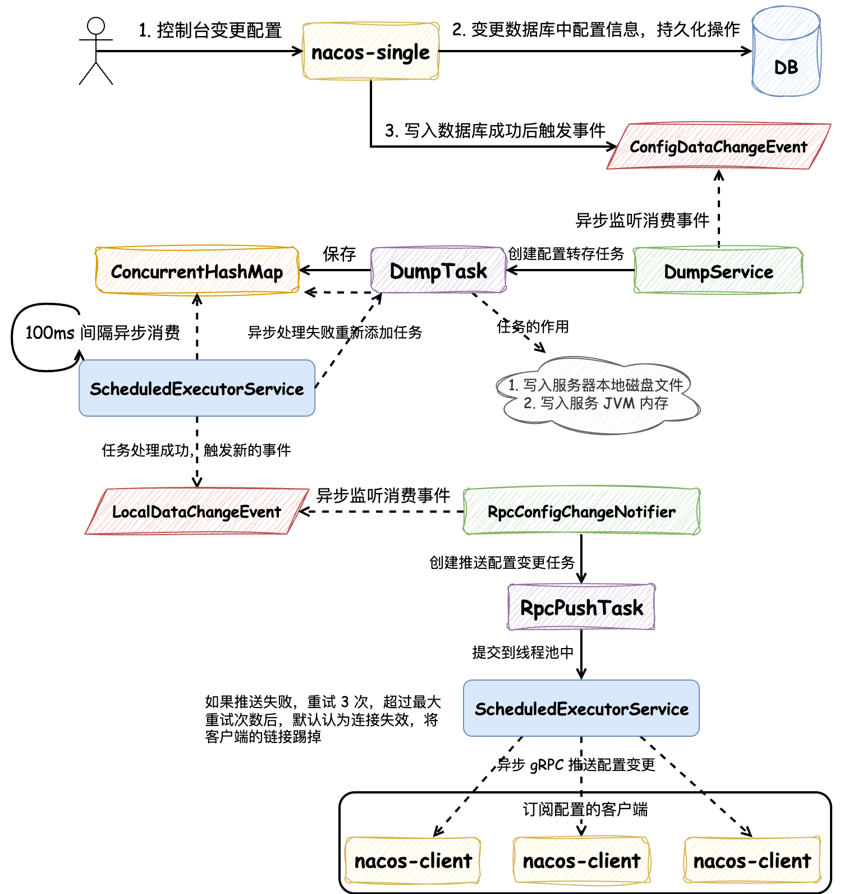
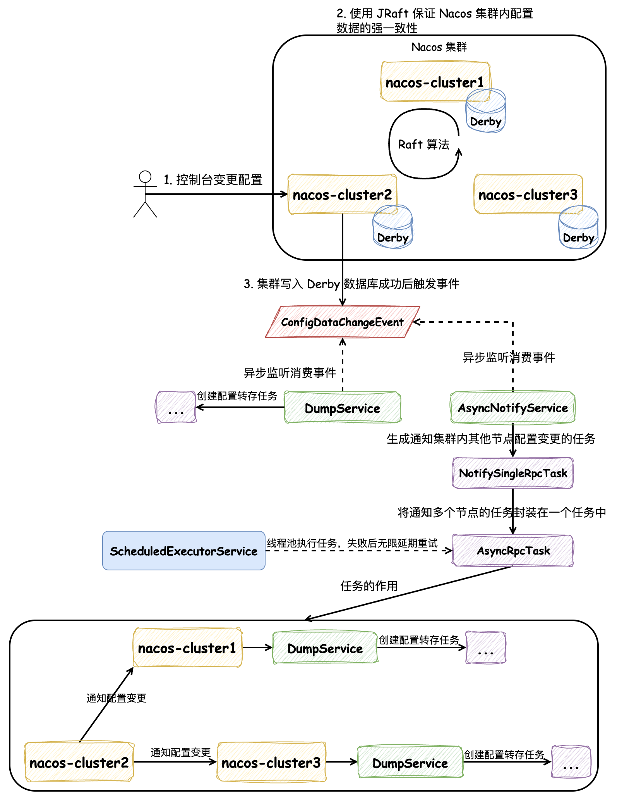
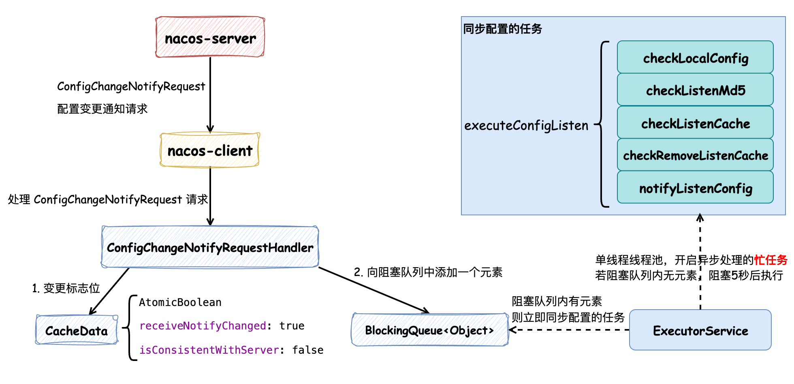

## Nacos 源码深度畅游：Nacos 配置同步详解

大家好，我是 **方圆**。最近学习了一下 Nacos 源码，顺便为 Nacos 开源项目提交了 10+ 个 PR，成为了 Nacos 项目的 Contributor。Nacos 是一个非常活跃且包容的社区，大家可以在 [Github-Nacos](https://github.com/alibaba/nacos) 关注并认领 ISSUE。本篇文章基于 Nacos 的 3.1.0 版本，准备详细解释一下 Nacos 对配置管理的核心流程，方便之后了解和学习 Nacos 的同学。

本文将主要分成两大部分：

1. 当配置发生变更时，Nacos Server 服务端是如何保证配置数据的一致性的，在这个小节内我们会讨论两种情况，分别关于单机部署和集群部署
2. 当配置发生变更时，Nacos Client 客户端是如何保证及时更新配置，并保证配置内容是最新的

在每个部分我都会在讲解源码前将具体的逻辑使用图示整理出来，方便想理解原理而不想看源码的同学，同时也能让想看源码的同学快速入手。如果大家对 Nacos 感兴趣，可以将源码 clone 下来，Debug 调试整个流程，这样学习和理解的效果更深。

### Nacos Server 服务端

当我们在 Nacos 控制台变更配置时，不论是单机部署还是集群部署都会经过以下逻辑，请求会由 `ConsoleConfigController` 来承接，调用其中的 `publishConfig` 发布配置的方法，如下所示：

```java
@NacosApi
@RestController
@RequestMapping("/v3/console/cs/config")
@ExtractorManager.Extractor(httpExtractor = ConfigDefaultHttpParamExtractor.class)
public class ConsoleConfigController {

    private final ConfigProxy configProxy;

    public ConsoleConfigController(ConfigProxy configProxy) {
        this.configProxy = configProxy;
    }
    
    @PostMapping()
    @Secured(action = ActionTypes.WRITE, signType = SignType.CONFIG, apiType = ApiType.CONSOLE_API)
    public Result<Boolean> publishConfig(HttpServletRequest request, ConfigFormV3 configForm) throws NacosException {
        // check required 
        configForm.validateWithContent();
        final boolean namespaceTransferred = NamespaceUtil.isNeedTransferNamespace(configForm.getNamespaceId());
        configForm.setNamespaceId(NamespaceUtil.processNamespaceParameter(configForm.getNamespaceId()));

        // check param
        ParamUtils.checkParam(configForm.getDataId(), configForm.getGroup(), "datumId", configForm.getContent());
        ParamUtils.checkParamV2(configForm.getTag());

        if (StringUtils.isBlank(configForm.getSrcUser())) {
            configForm.setSrcUser(RequestUtil.getSrcUserName(request));
        }
        if (!ConfigType.isValidType(configForm.getType())) {
            configForm.setType(ConfigType.getDefaultType().getType());
        }

        ConfigRequestInfo configRequestInfo = new ConfigRequestInfo();
        configRequestInfo.setSrcIp(RequestUtil.getRemoteIp(request));
        configRequestInfo.setRequestIpApp(RequestUtil.getAppName(request));
        configRequestInfo.setBetaIps(request.getHeader("betaIps"));
        configRequestInfo.setCasMd5(request.getHeader("casMd5"));
        configRequestInfo.setNamespaceTransferred(namespaceTransferred);

        return Result.success(configProxy.publishConfig(configForm, configRequestInfo));
    }
}
```

Controller 中并没有值得特别关注的逻辑，包含必要的参数校验和执行 `ConfigProxy#publishConfig` 方法，后者从命名来看，包含了 `Proxy` 字样，暗示它是一个代理类，具体的实现逻辑如下所示：

```java
@Service
public class ConfigProxy {

    private final ConfigHandler configHandler;

    @Autowired
    public ConfigProxy(ConfigHandler configHandler) {
        this.configHandler = configHandler;
    }

    /**
     * Add or update configuration.
     */
    public Boolean publishConfig(ConfigForm configForm, ConfigRequestInfo configRequestInfo) throws NacosException {
        return configHandler.publishConfig(configForm, configRequestInfo);
    }
    // ...
}
```

可以发现它使用了 **静态代理模式**，并没有做发布配置的逻辑，而是注入了 `ConfigHandler` 类，并调用其 `publishConfig` 方法，那么它代理了什么呢？如下图所示：


`ConfigHandler` 是一个接口，它有多个实现类，当在 Nacos 中采用不同的配置时，会注入不同的实现类，所以这部分代理操作实际上根据不同的配置来选择不同的策略。在这里我们仅关注 `ConfigInnerHandler` 实现策略，它会执行到 `ConfigOperationService#publishConfig` 发布配置的核心逻辑。这个方法的逻辑虽然很长，但是其中值得关注的内容我已经用序号标注了，分别为 “写入数据库的逻辑” 和 “发布 `ConfigDataChangeEvent` 配置变更事件”：

```java
public class ConfigOperationService {

    private ConfigInfoPersistService configInfoPersistService;

    private ConfigInfoGrayPersistService configInfoGrayPersistService;

    private ConfigMigrateService configMigrateService;

    private static final Logger LOGGER = LoggerFactory.getLogger(ConfigOperationService.class);

    public ConfigOperationService(ConfigInfoPersistService configInfoPersistService,
                                  ConfigInfoGrayPersistService configInfoGrayPersistService,
                                  ConfigMigrateService configMigrateService) {
        this.configInfoPersistService = configInfoPersistService;
        this.configInfoGrayPersistService = configInfoGrayPersistService;
        this.configMigrateService = configMigrateService;
    }
    
    public Boolean publishConfig(ConfigForm configForm, ConfigRequestInfo configRequestInfo, String encryptedDataKey) throws NacosException {
        Map<String, Object> configAdvanceInfo = getConfigAdvanceInfo(configForm);
        ParamUtils.checkParam(configAdvanceInfo);

        configForm.setEncryptedDataKey(encryptedDataKey);
        ConfigInfo configInfo = new ConfigInfo(configForm.getDataId(), configForm.getGroup(),
                configForm.getNamespaceId(), configForm.getAppName(), configForm.getContent());
        // set old md5
        if (StringUtils.isNotBlank(configRequestInfo.getCasMd5())) {
            configInfo.setMd5(configRequestInfo.getCasMd5());
        }
        configInfo.setType(configForm.getType());
        configInfo.setEncryptedDataKey(encryptedDataKey);

        // 1. 写入数据库的逻辑：区分了 md5 是否为空
        if (StringUtils.isNotBlank(configRequestInfo.getCasMd5())) {
            // 非空会执行 CAS 比较并交换的操作
            configOperateResult = configInfoPersistService.insertOrUpdateCas(configRequestInfo.getSrcIp(),
                    configForm.getSrcUser(), configInfo, configAdvanceInfo);
            if (!configOperateResult.isSuccess()) {
                LOGGER.warn(
                        "[cas-publish-config-fail] srcIp = {}, dataId= {}, casMd5 = {}, msg = server md5 may have changed.",
                        configRequestInfo.getSrcIp(), configForm.getDataId(), configRequestInfo.getCasMd5());
                throw new NacosApiException(HttpStatus.INTERNAL_SERVER_ERROR.value(), ErrorCode.RESOURCE_CONFLICT,
                        "Cas publish fail, server md5 may have changed.");
            }
        } else {
            if (configRequestInfo.getUpdateForExist()) {
                configOperateResult = configInfoPersistService.insertOrUpdate(configRequestInfo.getSrcIp(),
                        configForm.getSrcUser(), configInfo, configAdvanceInfo);
            } else {
                try {
                    configOperateResult = configInfoPersistService.addConfigInfo(configRequestInfo.getSrcIp(),
                            configForm.getSrcUser(), configInfo, configAdvanceInfo);
                } catch (DataIntegrityViolationException ive) {
                    configOperateResult = new ConfigOperateResult(false);
                }
            }
        }
        
        if (!configOperateResult.isSuccess()) {
            LOGGER.warn("[publish-config-failed] config already exists. dataId: {}, group: {}, namespaceId: {}",
                    configForm.getDataId(), configForm.getGroup(), configForm.getNamespaceId());
            throw new ConfigAlreadyExistsException(
                    String.format("config already exist, dataId: %s, group: %s, namespaceId: %s",
                            configForm.getDataId(), configForm.getGroup(), configForm.getNamespaceId()));
        }
        
        // 2. 发布 ConfigDataChangeEvent 配置变更事件
        ConfigChangePublisher.notifyConfigChange(
                new ConfigDataChangeEvent(configForm.getDataId(), configForm.getGroup(), configForm.getNamespaceId(),
                        configOperateResult.getLastModified()));
        
        return true;
    }
}
```

接下来我们根据 “单机部署，采用 MySQL 数据库” 和 “集群部署，采用内嵌 Derby 数据库” 来讨论具体的逻辑。

#### 单机部署，采用 MySQL 数据库

在单机部署并采用 MySQL 数据库时，Nacos 服务端在配置变更后执行逻辑的流程图如下所示：



在控制台变更配置后，会先写入 MySQL 数据库，写入成功继续执行，如果写入失败则抛出异常，控制台会提示配置写入失败，就不再执行后续的逻辑了。 

在写入 MySQL 数据库成功后，会触发 `ConfigDataChangeEvent` 配置发生变更的事件，由 `DumpService` 监听并消费。消费这个事件时，会创建 `DumpTask` 任务，这个任务的作用有两个：将配置信息 **写入本地磁盘文件** 和 **写入服务 JVM 内存**，这样 **即使在 MySQL 数据库发生宕机时，客户端也能正常读取配置信息**，写入本地磁盘相当于做了数据库的容灾。`DumpTask` 被创建后会被保存在一个 `ConcurrentHashMap` 中，由一个 `ScheduledExecutorService` 定时 100ms 执行的线程池定期处理任务，**如果任务在执行时失败，都会被重新添加到 `ConcurrentHashMap` 中，无限次重试处理**。

`DumpTask` 处理完成后，会再次发出 `LocalDataChangeEvent` 本地缓存变更事件，这个事件由 `RpcConfigChangeNotifier` 监听并消费。`RpcConfigChangeNotifier` 处理这个事件时会创建 `RpcPushTask` 为客户端推送配置变更的任务，这个任务同样会被添加到另一个 `ScheduledExecutorService` 中去执行，但是异步推送变更的任务不会无限重试，最多只会重试 3 次。在这里大家可能会有疑问：如果重试超过 3 次没有成功，那么 Nacos 客户端该如何获取到最新的配置变更呢？其实 Nacos 客户端不只是通过 Nacos 服务端推送获取配置变更，而且还能通过主动从 Nacos 服务端拉取获取配置变更，这个逻辑在后续的内容中解释。

以上便是 Nacos 服务端在单机部署并采用 MySQL 数据库时主要的逻辑流程，接下来我们深入分析具体的源码。

---

在 “写入数据库的逻辑” 中，Nacos 区分了 MD5 是否为空的两种情况，MD5 在 Nacos 表示的是什么含义呢？Nacos 中的每项配置都会根据其 **配置的内容** 计算出 MD5 值，并将其存储在数据库中，因为 MD5 加密后输出长度固定，所以可以根据配置的 MD5 值快速判断配置内容是否发生变更。

> MD5（Message Digest Algorithm 5）是一种广泛使用的密码散列函数，可以产生出一个128位（16字节）的散列值（hash value），用来确保信息传输完整一致。不过现在更推荐使用 SHA-256 或更新的散列算法来替代 MD5。

Nacos 在发布配置时，如果 MD5 值不为空则调用 `ConfigInfoPersistService#insertOrUpdateCas` 方法，这个方法使用了 **CAS** 操作，在执行 UPDATE SQL 时会先判断数据库中配置的 MD5 值是否与请求中的 MD5 值相同，如果相同则执行更新操作，否则不执行更新操作，这样能够避免多人在控制台同时修改配置造成的并发写入问题。

如果 MD5 值为空的话，那么直接调用 `ConfigInfoPersistService#insertOrUpdate` 方法，直接落库。

在数据库操作完成后，**配置变更已经在保存在数据库了**，之后会发布 `ConfigDataChangeEvent` 配置变更事件，这是一个异步处理的操作，在单机部署模式下，需要关注 `DumpService` 对这个事件的消费，它会执行 `DumpService#handleConfigDataChange` 方法，将配置变更事件转换为配置转储任务 `DumpTask`：

```java
/**
 * 监听并处理 ConfigDataChangeEvent 事件
 * 将 ConfigDataChangeEvent 转换为 DumpRequest，交给 DumpProcessor 处理
 * 作用：将配置变更事件转换为配置转储任务，更新本地缓存
 */
public abstract class DumpService {

    private TaskManager dumpTaskMgr;
    
    void handleConfigDataChange(Event event) {
        // Generate ConfigDataChangeEvent concurrently
        if (event instanceof ConfigDataChangeEvent) {
            ConfigDataChangeEvent evt = (ConfigDataChangeEvent) event;
            DumpRequest dumpRequest = DumpRequest.create(evt.dataId, evt.group, evt.tenant, evt.lastModifiedTs,
                    NetUtils.localIp());
            dumpRequest.setGrayName(evt.grayName);
            // 执行 dump 转储操作，由 DumpProcessor 处理
            DumpService.this.dump(dumpRequest);
        }
    }

    public void dump(DumpRequest dumpRequest) {
        dumpFormal(dumpRequest.getDataId(), dumpRequest.getGroup(), dumpRequest.getTenant(),
                    dumpRequest.getLastModifiedTs(), dumpRequest.getSourceIp());
    }

    private void dumpFormal(String dataId, String group, String tenant, long lastModified, String handleIp) {
        // 生成 Task 的 Key 值，格式为：dataId+group+tenant 
        // eg: default_config+DEFAULT_GROUP+public 其中 default_config 为配置的名称，DEFAULT_GROUP 为分组ID，public 为命名空间ID
        String groupKey = GroupKey2.getKey(dataId, group, tenant);
        String taskKey = groupKey;
        // 生成转储任务 DumpTask
        dumpTaskMgr.addTask(taskKey, new DumpTask(groupKey, null, lastModified, handleIp));
        DUMP_LOG.info("[dump] add formal task. groupKey={}", groupKey);

    }
}
```

调用 `TaskManager#addTask` 方法添加配置转储任务 `DumpTask`，最终会执行以下逻辑：

```java
public class NacosDelayTaskExecuteEngine extends AbstractNacosTaskExecuteEngine<AbstractDelayTask> {

    protected final ReentrantLock lock = new ReentrantLock();

    protected final ConcurrentHashMap<Object, AbstractDelayTask> tasks;
    
    @Override
    public void addTask(Object key, AbstractDelayTask newTask) {
        lock.lock();
        try {
            AbstractDelayTask existTask = tasks.get(key);
            if (null != existTask) {
                newTask.merge(existTask);
            }
            tasks.put(key, newTask);
        } finally {
            lock.unlock();
        }
    }
}
```

在这个方法中有两点需要注意：

1. `ReentrantLock lock` 变量：在向 `ConcurrentHashMap<Object, AbstractDelayTask> tasks` 添加任务时执行了加锁操作
2. `ConcurrentHashMap<Object, AbstractDelayTask> tasks` 变量：该变量是并发安全的，但是仍然在操作前执行了加锁操作

因为 `AbstractDelayTask#merge` 方法并不是并发安全的，多线程操作时可能发生未知的情况，所以便需要注意以上两点。现在，转储任务 `DumpTask` 已经被添加到 `ConcurrentHashMap<Object, AbstractDelayTask> tasks` 中了，那么这个任务是如何被执行的呢？

我们先看一下 `NacosDelayTaskExecuteEngine` 的构造方法，在构造方法中创建了 `ScheduledExecutorService processingExecutor` 变量用于定期（100ms）执行 `ProcessRunnable` 任务，`ProcessRunnable` 是静态内部类，调用 `processTasks` 方法来处理任务：

```java
public class NacosDelayTaskExecuteEngine extends AbstractNacosTaskExecuteEngine<AbstractDelayTask> {
    
    private final ScheduledExecutorService processingExecutor;

    protected final ConcurrentHashMap<Object, AbstractDelayTask> tasks;

    protected final ReentrantLock lock = new ReentrantLock();
    
    // processInterval 处理间隔默认值为 100ms
    public NacosDelayTaskExecuteEngine(String name, int initCapacity, Logger logger, long processInterval) {
        super(logger);
        tasks = new ConcurrentHashMap<>(initCapacity);
        processingExecutor = ExecutorFactory.newSingleScheduledExecutorService(new NameThreadFactory(name));
        processingExecutor.scheduleWithFixedDelay(new ProcessRunnable(), processInterval, processInterval, TimeUnit.MILLISECONDS);
    }
    
    private class ProcessRunnable implements Runnable {

        @Override
        public void run() {
            try {
                processTasks();
            } catch (Throwable e) {
                getEngineLog().error(e.toString(), e);
            }
        }
    }

    protected void processTasks() {
        Collection<Object> keys = getAllTaskKeys();
        for (Object taskKey : keys) {
            // 逐个删除而不是在上面统一删除，删除的时候而且加了锁，这样即使被多个线程拿到多个 Key，也能通过加锁避免执行重复的任务
            AbstractDelayTask task = removeTask(taskKey);
            if (null == task) {
                continue;
            }
            // 此处使用了策略模式，可以针对不同的 key 来定义不同的处理策略，这里默认使用了 DumpProcessor
            NacosTaskProcessor processor = getProcessor(taskKey);
            try {
                // 处理失败或者抛出异常都会重试
                if (!processor.process(task)) {
                    retryFailedTask(taskKey, task);
                }
            } catch (Throwable e) {
                getEngineLog().error("Nacos task execute error ", e);
                retryFailedTask(taskKey, task);
            }
        }
    }

    private void retryFailedTask(Object key, AbstractDelayTask task) {
        task.setLastProcessTime(System.currentTimeMillis());
        // 重新调用上文中的 NacosDelayTaskExecuteEngine#addTask 方法
        addTask(key, task);
    }

    @Override
    public Collection<Object> getAllTaskKeys() {
        Collection<Object> keys = new HashSet<>();
        lock.lock();
        try {
            // 将 DumpService 执行时添加的 Key 在这里获取，但没有删除操作，而是在后续的步骤中遍历一个加锁删除一个
            keys.addAll(tasks.keySet());
        } finally {
            lock.unlock();
        }
        return keys;
    }

    @Override
    public AbstractDelayTask removeTask(Object key) {
        lock.lock();
        try {
            AbstractDelayTask task = tasks.get(key);
            if (null != task && task.shouldProcess()) {
                return tasks.remove(key);
            } else {
                return null;
            }
        } finally {
            lock.unlock();
        }
    }
}
```

在上述逻辑中，`getAllTaskKeys` 和 `removeTask` 方法中仍然使用了 `ReentrantLock` 加锁，但是在这两个方法中都是读操作，而且是定时线程池定期执行，发生并发问题的概率非常小，实际上我认为可以采用不加锁的方案，或者可以考虑将 `ConcurrentHashMap` 换成 `ConcurrentLinkedDeque` 队列，任务在队列尾部添加，每次线程在执行任务时直接将队列头部的任务取出，**执行失败或者不满足执行条件再将它放回到队列中**。不过，这种异步执行任务的多线程设计采用的是 **“生产者消费者”模式**，这种设计方法还是非常值得学习的。

接下来我们看一下 `DumpProcessor#process` 方法中，到底执行了什么逻辑，如下所示，大部分都是参数赋值，重点是 **从数据库中将配置查询出来** 后，执行了 `DumpConfigHandler#configDump` 方法：

```java
public class DumpProcessor implements NacosTaskProcessor {

    final ConfigInfoPersistService configInfoPersistService;
    
    @Override
    public boolean process(NacosTask task) {
        DumpTask dumpTask = (DumpTask) task;
        String[] pair = GroupKey2.parseKey(dumpTask.getGroupKey());
        String dataId = pair[0];
        String group = pair[1];
        String tenant = pair[2];
        long lastModifiedOut = dumpTask.getLastModified();
        String handleIp = dumpTask.getHandleIp();
        String grayName = dumpTask.getGrayName();

        ConfigDumpEvent.ConfigDumpEventBuilder build = ConfigDumpEvent.builder().namespaceId(tenant).dataId(dataId)
                .group(group).grayName(grayName).handleIp(handleIp);
        String type = "formal";
        
        // 从数据库读取配置信息，构建 ConfigDumpEvent 事件
        ConfigInfoWrapper cf = configInfoPersistService.findConfigInfo(dataId, group, tenant);
        build.remove(Objects.isNull(cf));
        build.content(Objects.isNull(cf) ? null : cf.getContent());
        build.type(Objects.isNull(cf) ? null : cf.getType());
        build.encryptedDataKey(Objects.isNull(cf) ? null : cf.getEncryptedDataKey());
        build.lastModifiedTs(Objects.isNull(cf) ? lastModifiedOut : cf.getLastModified());
        return DumpConfigHandler.configDump(build.build());
    }
}
```

为了方便理解，省略一系列不重要的源码，最终会执行到 `ConfigCacheService#dumpWithMd5` 方法，在这个方法中修改缓存前会添加写锁 `tryWriteLock`，添加写锁成功后才能继续处理，后续处理逻辑中有两步比较重要：**“写入到本地文件”** 和 **“更新 JVM 本地缓存对象”**：

```java
public class ConfigCacheService {
    
    public static boolean dumpWithMd5(String dataId, String group, String tenant, String content, String md5,
                                      long lastModifiedTs, String type, String encryptedDataKey) {
        String groupKey = GroupKey2.getKey(dataId, group, tenant);
        CacheItem ci = makeSure(groupKey, encryptedDataKey);
        ci.setType(type);
        // 对某个缓存的操作添加了写锁
        final int lockResult = tryWriteLock(groupKey);

        if (lockResult < 0) {
            DUMP_LOG.warn("[dump-error] write lock failed. {}", groupKey);
            return false;
        }

        try {
            // 校验修改时间
            boolean lastModifiedOutDated = lastModifiedTs < ConfigCacheService.getLastModifiedTs(groupKey);
            if (lastModifiedOutDated) {
                DUMP_LOG.warn("[dump-ignore] timestamp is outdated,groupKey={}", groupKey);
                return true;
            }

            boolean newLastModified = lastModifiedTs > ConfigCacheService.getLastModifiedTs(groupKey);

            if (md5 == null) {
                md5 = MD5Utils.md5Hex(content, PERSIST_ENCODE);
            }

            // 1. 写入到本地文件中
            String localContentMd5 = ConfigCacheService.getContentMd5(groupKey);
            boolean md5Changed = !md5.equals(localContentMd5);
            if (md5Changed) {
                DUMP_LOG.info("[dump] md5 changed, save to disk cache ,groupKey={}, newMd5={},oldMd5={}", groupKey, md5, localContentMd5);
                ConfigDiskServiceFactory.getInstance().saveToDisk(dataId, group, tenant, content);
            } else {
                DUMP_LOG.warn("[dump-ignore] ignore to save to disk cache. md5 consistent,groupKey={}, md5={}", groupKey, md5);
            }

            // 2. 更新 JVM 本地缓存对象 CacheItem
            if (md5Changed) {
                DUMP_LOG.info(
                        "[dump] md5 changed, update md5 and timestamp in jvm cache ,groupKey={}, newMd5={},oldMd5={},lastModifiedTs={}",
                        groupKey, md5, localContentMd5, lastModifiedTs);
                updateMd5(groupKey, md5, content, lastModifiedTs, encryptedDataKey);
            } else if (newLastModified) {
                DUMP_LOG.info(
                        "[dump] md5 consistent ,timestamp changed, update timestamp only in jvm cache ,groupKey={},lastModifiedTs={}",
                        groupKey, lastModifiedTs);
                updateTimeStamp(groupKey, lastModifiedTs, encryptedDataKey);
            } else {
                DUMP_LOG.warn(
                        "[dump-ignore] ignore to save to jvm cache. md5 consistent and no new timestamp changed.groupKey={}",
                        groupKey);
            }

            return true;
        } catch (IOException ioe) {
            DUMP_LOG.error("[dump-exception] save disk error. " + groupKey + ", " + ioe);
            if (ioe.getMessage() != null) {
                String errMsg = ioe.getMessage();
                if (errMsg.contains(NO_SPACE_CN) || errMsg.contains(NO_SPACE_EN) || errMsg.contains(DISK_QUOTA_CN)
                        || errMsg.contains(DISK_QUOTA_EN)) {
                    // Protect from disk full.
                    FATAL_LOG.error("Local Disk Full,Exit", ioe);
                    EnvUtil.systemExit();
                }
            }
            return false;
        } finally {
            releaseWriteLock(groupKey);
        }
    }
    
}
```

我们先来看一下 “写入到本地文件” 的逻辑，它最终会执行到 `ConfigDiskService#saveToDisk` 方法：

```java
public class ConfigRawDiskService implements ConfigDiskService {
    
    // 将配置信息写入磁盘文件
    public void saveToDisk(String dataId, String group, String tenant, String content) throws IOException {
        File targetFile = targetFile(dataId, group, tenant);
        FileUtils.writeStringToFile(targetFile, content, ENCODE_UTF8);
    }
}
```

在这个方法中，它会将配置信息写入磁盘文件中，也就是说：**Nacos 配置变更后，会异步将配置信息写入磁盘文件**。这个文件何时被读取我们先不关注，我们先来考虑一下，如果配置变更在写入数据库成功后，服务立即宕机，也就是说磁盘文件还没有来得及写入，那么磁盘文件的数据该如何和数据库数据保持一致呢？

Nacos 借助 `@PostConstruct` 注解，在服务启动时，会执行 `DumpService#dumpOperate` 方法，这个方法的源码就不在这里贴了，它最终会执行到 `DumpAllProcessor#process` 方法，分页查询出所有的配置信息，逐一异步写入本地磁盘文件中，这样就保证了磁盘文件和数据库数据的一致性。

接下来我们再来看一下 “更新 JVM 本地缓存对象” 的逻辑，这段逻辑并不复杂，首先它需要保证在 JVM 本地缓存中创建了 `CacheItem` 本地缓存对象，然后创建 `ConfigCache` 对象记录必要的信息，注意在这段逻辑中，并没有为配置的内容 `content` 定义字段保存，这些逻辑完成后，发送了 `LocalDataChangeEvent` 事件：

> 发送 `LocalDataChangeEvent` 事件的逻辑比较隐蔽，就像分布式事务中协同式 Saga 的设计模式（参见《微服务设计模式》），一个事件处理完成再去处理下一个事件，这使得代码的复杂度增加。

```java
public class ConfigCacheService {

    /**
     * groupKey -> cacheItem.
     */
    static final ConcurrentHashMap<String, CacheItem> CACHE = new ConcurrentHashMap<>();
    
    public static void updateMd5(String groupKey, String md5, String content, long lastModifiedTs, String encryptedDataKey) {
        CacheItem cache = makeSure(groupKey, encryptedDataKey);
        ConfigCache configCache = cache.getConfigCache();
        if (configCache.getMd5() == null || !configCache.getMd5().equals(md5)) {
            configCache.setMd5(md5);
            configCache.setLastModifiedTs(lastModifiedTs);
            configCache.setEncryptedDataKey(encryptedDataKey);
            ConfigCachePostProcessorDelegate.getInstance().postProcess(configCache, content);
            // 更新本地 JVM 缓存后，发布 LocalDataChangeEvent 事件
            NotifyCenter.publishEvent(new LocalDataChangeEvent(groupKey));
        }
    }

    static CacheItem makeSure(final String groupKey, final String encryptedDataKey) {
        CacheItem item = CACHE.get(groupKey);
        if (null != item) {
            return item;
        }
        CacheItem tmp = new CacheItem(groupKey, encryptedDataKey);
        item = CACHE.putIfAbsent(groupKey, tmp);
        return (null == item) ? tmp : item;
    }
}
```

现在，配置变更已经成功写入数据库、磁盘文件和 JVM 内存，保证了在 Nacos Server 端配置数据的一致性。接下来便是由 Nacos Server 推送给 Nacos Client 的流程，这个逻辑便是在 `LocalDataChangeEvent` 事件的处理逻辑中完成的，`RpcConfigChangeNotifier#onEvent` 方法会监听 `LocalDataChangeEvent` 事件，并执行 `configDataChanged` 方法，这个方法的逻辑比较复杂，我们分段来看：

```java
public class RpcConfigChangeNotifier extends Subscriber<LocalDataChangeEvent> {

    @Autowired
    ConfigChangeListenContext configChangeListenContext;

    @Autowired
    private ConnectionManager connectionManager;
    
    @Override
    public void onEvent(LocalDataChangeEvent event) {
        String groupKey = event.groupKey;

        String[] strings = GroupKey.parseKey(groupKey);
        String dataId = strings[0];
        String group = strings[1];
        String tenant = strings.length > 2 ? strings[2] : "";

        // 监听LocalDataChangeEvent事件，通过 gRPC 双向流推送配置变更通知到客户端
        configDataChanged(groupKey, dataId, group, tenant);
    }
    
    public void configDataChanged(String groupKey, String dataId, String group, String tenant) {
        // 获取所有监听该配置的客户端连接
        Set<String> listeners = configChangeListenContext.getListeners(groupKey);
        if (CollectionUtils.isEmpty(listeners)) {
            return;
        }
        
        int notifyClientCount = 0;
        for (final String client : listeners) {
            Connection connection = connectionManager.getConnection(client);
            if (connection == null) {
                continue;
            }
            boolean ifNamespaceTransfer = configChangeListenContext.getConfigListenState(client, groupKey).isNamespaceTransfer();
            if (ifNamespaceTransfer) {
                tenant = null;
            }
            ConnectionMeta metaInfo = connection.getMetaInfo();
            String clientIp = metaInfo.getClientIp();

            // 构建 ConfigChangeNotifyRequest 请求，包含变更的配置信息
            ConfigChangeNotifyRequest notifyRequest = ConfigChangeNotifyRequest.build(dataId, group, tenant);

            // 创建 RpcPushTask 异步推送任务，支持重试机制
            RpcPushTask rpcPushRetryTask = new RpcPushTask(notifyRequest,
                    ConfigCommonConfig.getInstance().getMaxPushRetryTimes(), client, clientIp, metaInfo.getAppName());
            // 异步推送通知
            push(rpcPushRetryTask, connectionManager);
            notifyClientCount++;
        }
    }

    // 处理推送任务重试逻辑，支持延迟重试和连接管理
    private static void push(RpcPushTask retryTask, ConnectionManager connectionManager) {
        ConfigChangeNotifyRequest notifyRequest = retryTask.getNotifyRequest();
        if (retryTask.isOverTimes()) {
            // 重试次数超限，注销客户端连接
            connectionManager.unregister(retryTask.getConnectionId());
        } else if (connectionManager.getConnection(retryTask.getConnectionId()) != null) {
            // 客户端连接存在，延迟重试推送（首次延迟0s，第二次2s，第三次4s），
            // 本质上执行的是 ScheduledExecutorService#schedule(Runnable command, long delay, TimeUnit unit); 方法
            ConfigExecutor.scheduleClientConfigNotifier(retryTask, retryTask.getTryTimes() * 2, TimeUnit.SECONDS);
        } else {
            // 客户端已离线，忽略推送任务
        }
    }
}
```

在 `configDataChanged` 方法中，会先获取当前连接到 Nacos Server 的 所有订阅某个配置 `groupKey` 的 Nacos Client 连接，创建 `RpcPushTask` 异步推送任务，并调用 `push` 方法异步推送配置变更通知，注意这里执行配置推送任务时，使用的是 `ScheduledExecutorService#schedule` 它会根据重试次数指定延迟推送时间，首次推送是不延迟的，如果超过重试次数，表示客户端无法响应，则注销客户端连接，接下来我们看一下 `RpcPushTask` 的逻辑，它是 `RpcConfigChangeNotifier` 的内部类：

```java
public class RpcConfigChangeNotifier extends Subscriber<LocalDataChangeEvent> {
    
    class RpcPushTask implements Runnable {

        ConfigChangeNotifyRequest notifyRequest;

        int maxRetryTimes;

        int tryTimes = 0;

        String connectionId;

        String clientIp;

        String appName;

        public RpcPushTask(ConfigChangeNotifyRequest notifyRequest, int maxRetryTimes, String connectionId,
                           String clientIp, String appName) {
            this.notifyRequest = notifyRequest;
            this.maxRetryTimes = maxRetryTimes;
            this.connectionId = connectionId;
            this.clientIp = clientIp;
            this.appName = appName;
        }

        public boolean isOverTimes() {
            return maxRetryTimes > 0 && this.tryTimes >= maxRetryTimes;
        }

        // 异步执行配置推送任务
        @Override
        public void run() {
            // 累加推送配置的重试次数
            tryTimes++;
            TpsCheckRequest tpsCheckRequest = new TpsCheckRequest();

            tpsCheckRequest.setPointName(POINT_CONFIG_PUSH);
            if (!tpsControlManager.check(tpsCheckRequest).isSuccess()) {
                // TPS限流检查失败，延迟重试推送任务
                push(this, connectionManager);
            } else {
                // TPS检查通过，通过 gRPC 双向流推送配置变更通知到客户端
                rpcPushService.pushWithCallback(connectionId, notifyRequest,
                        new RpcPushCallback(this, tpsControlManager, connectionManager),
                        ConfigExecutor.getClientConfigNotifierServiceExecutor());
            }
        }
    }
}
```

`RpcPushTask#run` 方法中会先检查限流配置，如果限流检查通过会通过 gRPC 推送配置变更到 Nacos Client，借助的是 gRPC 的双向流接口，并根据结果调用 `RpcPushCallback` 中的回调方法，`RpcPushCallback` 是 `RpcConfigChangeNotifier` 的内部类。如果配置推送成功会记录推送成功统计，否则调用 `RpcConfigChangeNotifier#push` 方法重试推送配置，如果超过最大重试次数（3次）则注销掉客户端：

```java
public class RpcConfigChangeNotifier extends Subscriber<LocalDataChangeEvent> {
    
    static class RpcPushCallback extends AbstractPushCallBack {

        RpcPushTask rpcPushTask;

        TpsControlManager tpsControlManager;

        ConnectionManager connectionManager;

        public RpcPushCallback(RpcPushTask rpcPushTask, TpsControlManager tpsControlManager,
                               ConnectionManager connectionManager) {
            super(3000L);
            this.rpcPushTask = rpcPushTask;
            this.tpsControlManager = tpsControlManager;
            this.connectionManager = connectionManager;
        }

        @Override
        public void onSuccess() {
            // 客户端成功接收配置变更通知，记录推送成功统计
            TpsCheckRequest tpsCheckRequest = new TpsCheckRequest();
            tpsCheckRequest.setPointName(POINT_CONFIG_PUSH_SUCCESS);
            tpsControlManager.check(tpsCheckRequest);
        }

        @Override
        public void onFail(Throwable e) {
            // 推送失败，记录失败统计并进行重试
            TpsCheckRequest tpsCheckRequest = new TpsCheckRequest();
            tpsCheckRequest.setPointName(POINT_CONFIG_PUSH_FAIL);
            tpsControlManager.check(tpsCheckRequest);
            Loggers.REMOTE_PUSH.warn("Push fail, dataId={}, group={}, tenant={}, clientId={}",
                    rpcPushTask.getNotifyRequest().getDataId(), rpcPushTask.getNotifyRequest().getGroup(),
                    rpcPushTask.getNotifyRequest().getTenant(), rpcPushTask.getConnectionId(), e);
            push(rpcPushTask, connectionManager);
        }
    }
}
```

注意，`RpcPushTask` 在执行过程中都是没有被持久化的，也就是说一旦在执行过程中发生服务宕机，这些任务也会丢失，没有办法重新拉起向订阅配置的客户端推送，这样会不会导致客户端无法收到配置变更通知呢？实际上是不会的，配置变更除了服务端会主动推送以外，客户端还存在主动拉取的机制，也就是说 **配置同步是推、拉结合的**，保证客户端能够及时感知到配置变更，客户端的具体逻辑我们在后文中再解释。

以上我们讲解了 Nacos Server 单机采用 MySQL 数据库部署时，保证配置变更高可用的机制，接下来我们再看一下当集群部署并使用内嵌 Derby 数据库时，保证配置变更高可用的实现。

#### 集群部署，采用内嵌 Derby 数据库

Nacos Server 在集群模式部署时，也可以使用 MySQL 数据库，不过因为集群模式使用 MySQL 数据库与单机模式使用 MySQL 数据库对数据一致性的保证没有区别，所以我们就不再讨论这种情况了。值得讨论的是：在集群模式下，Nacos Server 还支持使用内嵌数据库 Derby 部署，这种情况下，Nacos 采用了 Raft 算法保证了集群的强一致性，Raft 算法的实现它使用的是 [开源项目 JRaft](https://www.sofastack.tech/projects/sofa-jraft/overview/)。在本文中，我们不会具体讲解 Raft 算法的流程，如果大家感兴趣可以参考文章 [深入理解分布式共识算法 Raft](https://juejin.cn/post/7544003305972088878)。如下图所示：



Nacos 在集群部署时，在控制台进行配置变更后，**请求只会打到其中一台服务上**，在这一台服务上会触发 JRaft 算法来完成各个服务内的 Derby 数据的写入，同样地，与写入 MySQL 的流程一致，只有在 JRaft 写入执行成功后才能继续处理。

在接收到请求的这台服务上，它会像单机模式一样发送 `ConfigDataChangeEvent` 事件，触发文件转存的操作，因为这部分内容是重复的就不再赘述了。集群模式与单机模式不同的是还有一个 `AsyncNotifyService` 服务会监听消费 `ConfigDataChangeEvent` 事件。`AsyncNotifyService` 的功能是 **通知集群内其他节点触发文件转存的操作**，如图所示，它会将通知集群内每个节点的请求封装成 `NotifySingleRpcTask`，创建所有节点的通知任务后，打包创建 `AsyncRpcTask` 任务，这个任务会被添加到 `ScheduledExecutorService` 线程池中，由线程池异步延时处理，如果发生处理失败的情况，会重新提交到线程池中，作为新的任务进行处理，以此来保证通知任务的处理成功。

以上就是 Nacos 在集群模式下采用 Derby 数据库时配置变更的处理流程，下面的内容我们根据源码来分析：当在 Nacos 控制台对配置进行修改时，Nacos 是如何借助 JRaft 保证数据一致性的。

---

同样地，`ConsoleConfigController#publishConfig` 方法是在 Nacos 控制台修改配置的入口，承接配置变更的 POST 请求：

```java
@NacosApi
@RestController
@RequestMapping("/v3/console/cs/config")
@ExtractorManager.Extractor(httpExtractor = ConfigDefaultHttpParamExtractor.class)
public class ConsoleConfigController {

    private final ConfigProxy configProxy;

    public ConsoleConfigController(ConfigProxy configProxy) {
        this.configProxy = configProxy;
    }
    
    @PostMapping()
    @Secured(action = ActionTypes.WRITE, signType = SignType.CONFIG, apiType = ApiType.CONSOLE_API)
    public Result<Boolean> publishConfig(HttpServletRequest request, ConfigFormV3 configForm) throws NacosException {
        // ...

        return Result.success(configProxy.publishConfig(configForm, configRequestInfo));
    }
}
```

因为 Nacos Server 启动时配置内嵌（Embedded）数据库 Derby，所以它会执行到 `EmbeddedConfigInfoPersistServiceImpl` 相关的方法中，我们以其中的 `EmbeddedConfigInfoPersistServiceImpl#updateConfigInfoCas` 方法为例，在这个方法中有一个私有方法 `updateConfigInfoAtomicCas` 特别关键，它主要在这里封装 SQL 的参数，并生成一条 SQL 并不立即执行，而是封装到上下文 `EmbeddedStorageContextHolder` 中：

```java
@Service("embeddedConfigInfoPersistServiceImpl")
public class EmbeddedConfigInfoPersistServiceImpl implements ConfigInfoPersistService {

    private ConfigOperateResult updateConfigInfoAtomicCas(final ConfigInfo configInfo, final String srcIp,
                                                          final String srcUser, Map<String, Object> configAdvanceInfo) {
        // 处理 SQL 的入参
        MapperContext context = new MapperContext();
        context.putUpdateParameter(FieldConstant.CONTENT, configInfo.getContent());
        // ...
        // 生成 SQL 而不执行（ConfigInfoMapper#updateConfigInfoAtomicCas 在接口中定义的 default 方法）
        MapperResult mapperResult = configInfoMapper.updateConfigInfoAtomicCas(context);

        // 保存在上下文中
        EmbeddedStorageContextHolder.addSqlContext(Boolean.TRUE, mapperResult.getSql(),
                mapperResult.getParamList().toArray());
        return getConfigInfoOperateResult(configInfo.getDataId(), configInfo.getGroup(), tenantTmp);
    }
}

public interface ConfigInfoMapper extends Mapper {
    default MapperResult updateConfigInfoAtomicCas(MapperContext context) {
        List<Object> paramList = new ArrayList<>();

        // 封装 set 中的参数
        paramList.add(context.getUpdateParameter(FieldConstant.CONTENT));
        // ...
        // 封装 where 中的参数
        paramList.add(context.getWhereParameter(FieldConstant.MD5));
        // ...
        String sql = "UPDATE config_info SET " + "content=?, md5=?, src_ip=?, src_user=?, gmt_modified="
                + getFunction("NOW()")
                + ", app_name=?, c_desc=?, c_use=?, effect=?, type=?, c_schema=?, encrypted_data_key=? "
                + "WHERE data_id=? AND group_id=? AND tenant_id=? AND (md5=? OR md5 IS NULL OR md5='')";
        return new MapperResult(sql, paramList);
    }
}
```

在这里有两个点值得注意：

1.  生成 Update SQL 而不执行，却放在了上下文 `EmbeddedStorageContextHolder` 中，它是一个 `ThreadLocal` 对象
2.  生成的 SQL 使用 CAS 的策略，在 WHERE 条件中它会将前端控制台配置的 MD5 值作为条件传入，防止并发修改配置时的脏写问题

现在既然已经将变更 Derby 数据库 Update SQL 保存在了上下文中，接下来就是看它什么时候被执行了，它会继续执行 `DatabaseOperate#blockUpdate` 方法，从它的命名中也能发现它是同步阻塞执行的逻辑：

```java
public interface DatabaseOperate {
    // ...
    
    // 阻塞更新逻辑
    default Boolean blockUpdate(BiConsumer<Boolean, Throwable> consumer) {
        try {
            // 在上下文中获取 SQL
            return update(EmbeddedStorageContextHolder.getCurrentSqlContext(), consumer);
        } finally {
            EmbeddedStorageContextHolder.cleanAllContext();
        }
    }

}
```

它是一个 `default` 方法，会调用 `DistributedDatabaseOperateImpl#update` 方法，它会将 SQL 封装在 `WriteRequest` 中，调用封装好的 Raft 协议的 `write` 方法：

```java
public class DistributedDatabaseOperateImpl extends RequestProcessor4CP implements BaseDatabaseOperate {

    private CPProtocol protocol;
    
    @Override
    public Boolean update(List<ModifyRequest> sqlContext, BiConsumer<Boolean, Throwable> consumer) {
        try {
            final String key =
                    System.currentTimeMillis() + "-" + group() + "-" + memberManager.getSelf().getAddress() + "-"
                            + MD5Utils.md5Hex(sqlContext.toString(), PersistenceConstant.DEFAULT_ENCODE);
            WriteRequest request = WriteRequest.newBuilder().setGroup(group()).setKey(key)
                    // 将 SQL 序列化成字节数组保存在 WriteRequest 中
                    .setData(ByteString.copyFrom(serializer.serialize(sqlContext)))
                    .putAllExtendInfo(EmbeddedStorageContextHolder.getCurrentExtendInfo())
                    .setType(sqlContext.getClass().getCanonicalName()).build();
            
            if (Objects.isNull(consumer)) {
                // 重要：raft 协议 write 开始执行，同步阻塞调用
                Response response = this.protocol.write(request);
                if (response.getSuccess()) {
                    return true;
                }
                LOGGER.error("execute sql modify operation failed : {}", response.getErrMsg());
                return false;
            } else {
                // ...
            }
            return true;
        } catch (TimeoutException e) {
            LOGGER.error("An timeout exception occurred during the update operation");
            throw new NacosRuntimeException(NacosException.SERVER_ERROR, e.toString());
        } catch (Throwable e) {
            LOGGER.error("An exception occurred during the update operation : {}", e);
            throw new NacosRuntimeException(NacosException.SERVER_ERROR, e.toString());
        }
    }
}
```

其中 `Response response = this.protocol.write(request);` 逻辑为执行 Raft 算法的写流程：

```java
public class JRaftProtocol extends AbstractConsistencyProtocol<RaftConfig, RequestProcessor4CP>
        implements CPProtocol<RaftConfig, RequestProcessor4CP> {

    @Override
    public Response write(WriteRequest request) throws Exception {
        // 依靠 CompletableFuture 实现阻塞同步调用
        CompletableFuture<Response> future = writeAsync(request);
        return future.get(10_000L, TimeUnit.MILLISECONDS);
    }

    @Override
    public CompletableFuture<Response> writeAsync(WriteRequest request) {
        return raftServer.commit(request.getGroup(), request, new CompletableFuture<>());
    }
}
```

在这段逻辑中依靠 `CompletableFuture` 实现了同步阻塞的写调用。`JRaftServer#commit` 方法是处理 Raft 算法中写请求的流程：

```java
public class JRaftServer {
    /**
     * [raft] 处理写请求，所有写操作必须通过 Leader 节点处理
     */
    public CompletableFuture<Response> commit(final String group, final Message data,
                                              final CompletableFuture<Response> future) {
        LoggerUtils.printIfDebugEnabled(Loggers.RAFT, "data requested this time : {}", data);
        final RaftGroupTuple tuple = findTupleByGroup(group);
        if (tuple == null) {
            future.completeExceptionally(new IllegalArgumentException("No corresponding Raft Group found : " + group));
            return future;
        }

        FailoverClosureImpl closure = new FailoverClosureImpl(future);

        final Node node = tuple.node;
        if (node.isLeader()) {
            // 当前节点是 Leader，直接应用写操作到状态机
            applyOperation(node, data, closure);
        } else {
            // 当前节点不是 Leader，将请求转发给 Leader 处理
            invokeToLeader(group, data, rpcRequestTimeoutMs, closure);
        }
        return future;
    }
}
```

如果是 Leader 节点的话，直接操作日志写入，在这里的逻辑都是与 JRaft 框架相关了，不过我们只需要关注与 Raft 算法有关的流程，注意注释信息：

```java
public class JRaftServer {
    
    public void applyOperation(Node node, Message data, FailoverClosure closure) {
        // Task 是用户使用 jraft 最核心的类之一，用于向一个 raft 集群提交一个任务，这个任务提交到 leader，并复制到其他 follower 节点
        // 通俗的理解为让 Leader 节点记录 log 日志，并同步到其他 Follower 节点
        final Task task = new Task();
        // done 表示任务的回调方法，在任务完成的时候，即 apply 的时候，通知此回调对象，无论成功还是失败。
        task.setDone(new NacosClosure(data, status -> {
            NacosClosure.NacosStatus nacosStatus = (NacosClosure.NacosStatus) status;
            closure.setThrowable(nacosStatus.getThrowable());
            closure.setResponse(nacosStatus.getResponse());
            closure.run(nacosStatus);
        }));

        // add request type field at the head of task data.
        byte[] requestTypeFieldBytes = new byte[2];
        requestTypeFieldBytes[0] = ProtoMessageUtil.REQUEST_TYPE_FIELD_TAG;
        if (data instanceof ReadRequest) {
            requestTypeFieldBytes[1] = ProtoMessageUtil.REQUEST_TYPE_READ;
        } else {
            requestTypeFieldBytes[1] = ProtoMessageUtil.REQUEST_TYPE_WRITE;
        }

        // data 任务的数据，在本次逻辑中是变更配置的 SQL，用户应当将要复制的业务数据通过一定序列化方式（比如 java/hessian2) 序列化成一个 ByteBuffer，放到 task 里
        byte[] dataBytes = data.toByteArray();
        task.setData((ByteBuffer) ByteBuffer.allocate(requestTypeFieldBytes.length + dataBytes.length)
                .put(requestTypeFieldBytes).put(dataBytes).position(0));
        // 使用 node 提交任务，node 可以为是 Raft 集群的 Leader 节点，操作 apply 方法之后表示将日志记录下来并给其他 Follower 节点同步
        node.apply(task);
    }
}
```

当在 Raft 集群中有超过半数节点已经将本次任务的日志持久化后，它会自动调用 `StateMachineAdapter#onApply` 方法，表示将日志应用到状态机，即使写请求生效：

```java
class NacosStateMachine extends StateMachineAdapter {
    
    /**
     * 最核心的方法，应用任务列表应用到状态机，任务将按照提交顺序应用。
     * 请注意，当这个方法返回的时候，我们就认为这一批任务都已经成功应用到状态机上，如果你没有完全应用（比如错误、异常），
     * 将会被当做一个 critical 级别的错误，报告给状态机的 StateMachineAdapter#onError 方法，错误类型为 ERROR_TYPE_STATE_MACHINE
     */
    @Override
    public void onApply(Iterator iter) {
        int index = 0;
        int applied = 0;
        Message message;
        NacosClosure closure = null;
        try {
            // 遍历处理本次应用的任务（日志）
            while (iter.hasNext()) {
                // 结果通过 Status 告知，Status#isOk() 告诉你成功还是失败
                Status status = Status.OK();
                try {
                    // 如果 task 没有设置 closure，那么 done 会是 null，
                    // 另外在 follower 节点上，done 也是 null，因为 done 不会被复制到除了 leader 节点之外的其他 raft 节点
                    if (iter.done() != null) {
                        // 获取回调函数
                        closure = (NacosClosure) iter.done();
                        // 从 Leader 节点的日志条目中获取消息
                        message = closure.getMessage();
                    } else {
                        // 从 Follower 节点复制的日志条目中解析消息
                        final ByteBuffer data = iter.getData();
                        // 解析成 SQL
                        message = ProtoMessageUtil.parse(data.array());
                        if (message instanceof ReadRequest) {
                            // Follower 节点忽略读请求，只处理写请求
                            applied++;
                            index++;
                            iter.next();
                            continue;
                        }
                    }

                    LoggerUtils.printIfDebugEnabled(Loggers.RAFT, "receive log : {}", message);

                    // 应用写请求到业务状态机，实现数据的持久化存储
                    if (message instanceof WriteRequest) {
                        // 使 Update SQL 执行并生效，在 Response 中返回执行结果
                        Response response = processor.onApply((WriteRequest) message);
                        // 对结果的后置处理
                        postProcessor(response, closure);
                    }

                    // 处理读请求（仅在 Leader 节点）
                    if (message instanceof ReadRequest) {
                        Response response = processor.onRequest((ReadRequest) message);
                        postProcessor(response, closure);
                    }
                } catch (Throwable e) {
                    index++;
                    status.setError(RaftError.UNKNOWN, e.toString());
                    Optional.ofNullable(closure).ifPresent(closure1 -> closure1.setThrowable(e));
                    throw e;
                } finally {
                    Optional.ofNullable(closure).ifPresent(closure1 -> closure1.run(status));
                }

                applied++;
                index++;
                iter.next();
            }
        } catch (Throwable t) {
            // 状态机应用失败时进行回滚，保证数据一致性
            Loggers.RAFT.error("processor : {}, stateMachine meet critical error: {}.", processor, t);
            iter.setErrorAndRollback(index - applied,
                    new Status(RaftError.ESTATEMACHINE, "StateMachine meet critical error: %s.",
                            ExceptionUtil.getStackTrace(t)));
        }
    }
}
```

因为将任务应用到状态机时会在 Leader 和 Follower 节点都执行，所以以上逻辑会包含针对 Leader 节点和 Follower 节点的执行逻辑。它会在 `Response response = processor.onApply((WriteRequest) message);` 逻辑中完成 Update SQL 的执行，如下 `DistributedDatabaseOperateImpl#onApply` 方法：

```java
@Conditional(ConditionDistributedEmbedStorage.class)
@Component
public class DistributedDatabaseOperateImpl extends RequestProcessor4CP implements BaseDatabaseOperate {
    
    @Override
    public Response onApply(WriteRequest log) {
        LoggerUtils.printIfDebugEnabled(LOGGER, "onApply info : log : {}", log);
        final ByteString byteString = log.getData();
        Preconditions.checkArgument(byteString != null, "Log.getData() must not null");
        final Lock lock = readLock;
        lock.lock();
        try {
            // 将任务中的数据转换成本次修改配置要执行的 SQL
            List<ModifyRequest> sqlContext = serializer.deserialize(byteString.toByteArray(), List.class);
            sqlLimiter.doLimitForModifyRequest(sqlContext);
            boolean isOk = false;
            // 区分导入和非导入逻辑
            if (log.containsExtendInfo(DATA_IMPORT_KEY)) {
                isOk = doDataImport(jdbcTemplate, sqlContext);
            } else {
                sqlContext.sort(Comparator.comparingInt(ModifyRequest::getExecuteNo));
                // 执行修改 SQL
                isOk = update(transactionTemplate, jdbcTemplate, sqlContext);
                PersistenceExecutor.executeEmbeddedDump(() -> {
                    for (EmbeddedApplyHook each : EmbeddedApplyHookHolder.getInstance().getAllHooks()) {
                        each.afterApply(log);
                    }
                });
            }

            return Response.newBuilder().setSuccess(isOk).build();
        } catch (BadSqlGrammarException | DataIntegrityViolationException e) {
            return Response.newBuilder().setSuccess(false).setErrMsg(e.toString()).build();
        } catch (DataAccessException e) {
            throw new ConsistencyException(e.toString());
        } catch (Exception e) {
            LoggerUtils.printIfWarnEnabled(LOGGER, "onApply warn : log : {}", log, e);
            return Response.newBuilder().setSuccess(false).setErrMsg(e.toString()).build();
        } finally {
            lock.unlock();
        }
    }
}
```

执行完成后，通过 `Response` 对象来判断执行成功还是执行失败，`postProcessor` 方法负责后置处理，最终回调的逻辑如下：

```java
public class FailoverClosureImpl implements FailoverClosure {
    
    // ...
    
    private final CompletableFuture<Response> future;
    
    @Override
    public void run(Status status) {
        // 调用 CompletableFuture#complete 方法标记任务完成，同步阻塞调用恢复，并返回结果值
        if (status.isOk()) {
            future.complete(data);
            return;
        }
        final Throwable throwable = this.throwable;
        future.completeExceptionally(Objects.nonNull(throwable) ? new ConsistencyException(throwable.getMessage())
                : new ConsistencyException("operation failure"));
    }
    
}
```

其中 `future` 字段为在执行 Raft 的写请求时保证同步阻塞调用的 `CompletableFuture`，如果执行成功调用 `CompletableFuture#complete` 方法便能让停止阻塞并返回结果，以上便是在 Nacos 集群中执行写请求的流程。在 Nacos 源码的 `DistributedDatabaseOperateImpl` 类上有以下流程图注释能非常清晰的反映整个流程：

1. 用户 `user` 执行配置变更时执行 `publishConfig` 的逻辑，要执行的 SQL 会被保存在上下文 `SqlContextUtils` 中
2. 对数据库的操作都会被提交到 JRaft 协议状态机 `JRaftProtocol` 中执行，应用 `onApply` 到状态机时会从上下文 `SqlContextUtils` 中获取 SQL 并执行
3. 同步阻塞返回用户 `user` 结果

```text
                   ┌────────────────────┐
               ┌──▶│   PersistService   │
               │   └────────────────────┘ ┌─────────────────┐
               │              │           │                 │
               │              │           │                 │
               │              │           │                 │
               │              │           │                 │
               │              │           │                 │
               │              │           │                 │
               │              │           │                 │
               │              │           │                 ▼
               │              │           │      ┌────────────────────┐          save sql
               │              ▼           │      │     saveConfig     │──────────context─────────────┐
               │     ┌────────────────┐   │      └────────────────────┘                              │
               │     │ publishConfig  │───┘                 │                                        │
               │     └────────────────┘                     │                                        │
               │                                            ▼                                        ▼
               │                               ┌─────────────────────────┐    save sql    ┌────────────────────┐
               │                               │ saveConfigTagRelations  │────context────▶│  SqlContextUtils   │◀─┐
        publish config                         └─────────────────────────┘                └────────────────────┘  │
               │                                            │                                        ▲            │
               │                                            │                                        │            │
               │                                            ▼                                        │            │
               │                                ┌───────────────────────┐         save sql           │            │
            ┌────┐                              │   saveConfigHistory   │─────────context────────────┘            │
            │user│                              └───────────────────────┘                                         │
            └────┘                                                                                                │
               ▲                                                                                                  │
               │                                           ┌1:getCurrentSqlContexts───────────────────────────────┘
               │                                           │
               │                                           │
               │                                           │
               │           ┌───────────────┐    ┌─────────────────────┐
               │           │ JdbcTemplate  │◀───│   DatabaseOperate   │───┐
       4:execute result    └───────────────┘    └─────────────────────┘   │
               │                   │                       ▲              │
               │                   │                       │              │
               │                   │                  3:onApply         2:submit(List<ModifyRequest>)
               │                   │                       │              │
               │                   ▼                       │              │
               │           ┌──────────────┐                │              │
               │           │ Apache Derby │    ┌───────────────────────┐  │
               │           └──────────────┘    │     JRaftProtocol     │◀─┘
               │                               └───────────────────────┘
               │                                           │
               │                                           │
               └───────────────────────────────────────────┘
```

当 Raft 的流程执行完成后，会回到在文章开头我们提到的 `ConfigOperationService#publishConfig` 方法中，在单机部署的模式下，我们提到过：Nacos 会触发 `ConfigDataChangeEvent` 事件来触发 `DumpTask` 来将配置信息写入到本地磁盘文件和 JVM 缓存中，并在随后触发 `LocalDataChangeEvent` 事件通知连接到该单机上所有的 Nacos Client 保证配置变更的通知。现在我们来考虑一个问题：当我们在控制台修改配置信息时，配置变更的请求只会打到 Nacos 集群的某一台服务上，在这一台服务上会执行 Dump 文件的操作并通知连接到该台服务器上的 Nacos Client 配置变更，那 **集群中其他节点是不是也需要通知连接到本身的 Nacos Client 配置变更** 呢？答案是肯定的。

在集群模式下，`ConfigDataChangeEvent` 事件会被 `AsyncNotifyService` 消费，其中的 `AsyncNotifyService#handleConfigDataChangeEvent` 方法会处理 `ConfigDataChangeEvent` 事件来完成通知集群内其他节点配置发生变更的操作：

```java
@Service
public class AsyncNotifyService {

    private ServerMemberManager memberManager;
    
    // 处理 ConfigDataChangeEvent 事件
    void handleConfigDataChangeEvent(Event event) {
        if (event instanceof ConfigDataChangeEvent) {
            ConfigDataChangeEvent evt = (ConfigDataChangeEvent) event;

            MetricsMonitor.incrementConfigChangeCount(evt.tenant, evt.group, evt.dataId);
            // 集群中除了自己的所有节点
            Collection<Member> ipList = memberManager.allMembersWithoutSelf();

            Queue<NotifySingleRpcTask> rpcQueue = new LinkedList<>();

            for (Member member : ipList) {
                // 生成通知其他节点数据变更的任务，包含配置信息和节点IP信息
                NotifySingleRpcTask notifySingleRpcTask = generateTask(evt, member);
                // 加入队列
                rpcQueue.add(notifySingleRpcTask);
            }
            // 异步执行任务
            if (!rpcQueue.isEmpty()) {
                ConfigExecutor.executeAsyncNotify(new AsyncRpcTask(rpcQueue));
            }
        }
    }   
}
```

它会将变更的配置和要通知的节点信息封装成一个个 `NotifySingleRpcTask` 异步任务，并放在队列 `Queue<NotifySingleRpcTask>` 中，随后使用线程池异步执行 `ConfigExecutor#executeAsyncNotify` 队列中所有的任务。`AsyncRpcTask` 是在 `AsyncNotifyService` 封装的内部类，执行通知的逻辑为 `AsyncNotifyService#executeAsyncRpcTask` 方法，借助 gRPC 通知其他节点，并在失败后重试，请关注以下逻辑的注释信息：

```java
@Service
public class AsyncNotifyService {

    private static final int MIN_RETRY_INTERVAL = 500;

    private static final int INCREASE_STEPS = 1000;

    private static final int MAX_COUNT = 6;
    
    @Autowired
    private ConfigClusterRpcClientProxy configClusterRpcClientProxy;

    private ServerMemberManager memberManager;
    
    public class AsyncRpcTask implements Runnable {

        private Queue<NotifySingleRpcTask> queue;

        public AsyncRpcTask(Queue<NotifySingleRpcTask> queue) {
            this.queue = queue;
        }

        @Override
        public void run() {
            // 处理通知其他节点配置变更的任务
            executeAsyncRpcTask(queue);
        }
    }
    
    void executeAsyncRpcTask(Queue<NotifySingleRpcTask> queue) {
        while (!queue.isEmpty()) {
            NotifySingleRpcTask task = queue.poll();

            ConfigChangeClusterSyncRequest syncRequest = new ConfigChangeClusterSyncRequest();
            syncRequest.setDataId(task.getDataId());
            syncRequest.setTenant(task.getTenant());
            syncRequest.setGroup(task.getGroup());
            syncRequest.setLastModified(task.getLastModified());
            syncRequest.setGrayName(task.getGrayName());
            syncRequest.setBeta(task.isBeta());
            syncRequest.setTag(task.getTag());
            Member member = task.member;

            String event = getNotifyEvent(task);
            if (memberManager.hasMember(member.getAddress())) {
                // 将可能下线的服务放入异步队列延迟执行，健康的服务器直接通知
                boolean unHealthNeedDelay = isUnHealthy(member.getAddress());
                if (unHealthNeedDelay) {
                    ConfigTraceService.logNotifyEvent(task.getDataId(), task.getGroup(), task.getTenant(), null,
                            task.getLastModified(), InetUtils.getSelfIP(), event,
                            ConfigTraceService.NOTIFY_TYPE_UNHEALTH, 0, member.getAddress());
                    asyncTaskExecute(task);
                } else {
                    try {
                        // gRPC 通知配置发生变更
                        configClusterRpcClientProxy.syncConfigChange(member, syncRequest,
                                new AsyncRpcNotifyCallBack(AsyncNotifyService.this, task));
                    } catch (Exception e) {
                        // 无限重试，直到重试成功或服务停止
                        MetricsMonitor.getConfigNotifyException().increment();
                        asyncTaskExecute(task);
                    }
                }
            } else {
                //No nothing if  member has offline.
            }
        }
    }

    private void asyncTaskExecute(NotifySingleRpcTask task) {
        // 获取重试延迟时间
        int delay = getDelayTime(task);
        Queue<NotifySingleRpcTask> queue = new LinkedList<>();
        queue.add(task);
        // 借助 ScheduledExecutorService 线程池延迟执行的任务
        AsyncRpcTask asyncTask = new AsyncRpcTask(queue);
        ConfigExecutor.scheduleAsyncNotify(asyncTask, delay, TimeUnit.MILLISECONDS);
    }

    // 执行失败后获取延迟执行的时间
    private static int getDelayTime(NotifySingleRpcTask task) {
        // 失败次数
        int failCount = task.getFailCount();
        // 指数级计算重试间隔
        int delay = MIN_RETRY_INTERVAL + failCount * failCount * INCREASE_STEPS;
        // 最大重试次数限制，超过后仍然继续重试，只是限制了重试间隔的指数爆炸
        if (failCount <= MAX_COUNT) {
            task.setFailCount(failCount + 1);
        }
        return delay;
    }
    
}
```

集群中其他节点在收到 `ConfigChangeClusterSyncRequest` 请求后，会在 `ConfigChangeClusterSyncRequestHandler` 类中处理：

```java
@Component
@InvokeSource(source = {RemoteConstants.LABEL_SOURCE_CLUSTER})
public class ConfigChangeClusterSyncRequestHandler
        extends RequestHandler<ConfigChangeClusterSyncRequest, ConfigChangeClusterSyncResponse> {

    private final DumpService dumpService;

    private ConfigMigrateService configMigrateService;

    public ConfigChangeClusterSyncRequestHandler(DumpService dumpService,
                                                 ConfigMigrateService configMigrateService) {
        this.dumpService = dumpService;
        this.configMigrateService = configMigrateService;
    }

    @Override
    @NamespaceValidation
    @TpsControl(pointName = "ClusterConfigChangeNotify")
    @ExtractorManager.Extractor(rpcExtractor = ConfigRequestParamExtractor.class)
    @Secured(signType = SignType.CONFIG, apiType = ApiType.INNER_API)
    public ConfigChangeClusterSyncResponse handle(ConfigChangeClusterSyncRequest configChangeSyncRequest,
                                                  RequestMeta meta) throws NacosException {
        // 参数校验
        checkCompatity(configChangeSyncRequest, meta);
        ParamUtils.checkParam(configChangeSyncRequest.getTag());
        
        // 执行 Dump 操作
        DumpRequest dumpRequest = DumpRequest.create(configChangeSyncRequest.getDataId(),
                configChangeSyncRequest.getGroup(), configChangeSyncRequest.getTenant(),
                configChangeSyncRequest.getLastModified(), meta.getClientIp());
        dumpRequest.setGrayName(configChangeSyncRequest.getGrayName());
        dumpService.dump(dumpRequest);
        
        return new ConfigChangeClusterSyncResponse();
    }
    
    // ...
}
```

它的逻辑非常简单，接受到请求后，执行文件 Dump 操作并通知连接到服务本身的所有 Nacos Client 客户端配置发生变更。接下来，我们再看一下在 Nacos Server 端通过控制台查询配置数据时，读取 Derby 数据库是如何读取的。在开始具体的逻辑前，先给大家留一个问题：在集群模式部署时，每个集群实例都有一份配置数据的副本，当请求打到不同的实例时，如果存在实例未完成最新配置数据的写入，会不会存在多次请求不一致的情况呢？

##### 在 Nacos Server 端通过控制台读取配置数据

在 Nacos 集群模式下使用内嵌 Derby 数据库时遵循 Raft 算法，如果要查询配置信息时它采用的是 **ReadIndex Read 实现线性一致性读**，我们直接略过非核心代码，分析与 Raft 相关的源码部分：

```java
public class JRaftServer {
    /**
     * [raft] 处理读请求，使用 ReadIndex 机制保证线性一致性读
     */
    CompletableFuture<Response> get(final ReadRequest request) {
        final String group = request.getGroup();
        CompletableFuture<Response> future = new CompletableFuture<>();
        final RaftGroupTuple tuple = findTupleByGroup(group);
        if (Objects.isNull(tuple)) {
            future.completeExceptionally(new NoSuchRaftGroupException(group));
            return future;
        }
        final Node node = tuple.node;
        final RequestProcessor processor = tuple.processor;
        try {
            // 使用 ReadIndex Read 机制确保读取到的数据是最新的已提交数据
            // 其中 requestContext （第一个入参）提供给用户作为请求的附加上下文，可以在 closure 里再次拿到继续处理
            node.readIndex(BytesUtil.EMPTY_BYTES, new ReadIndexClosure() {
                @Override
                public void run(Status status, long index, byte[] reqCtx) {
                    // ReadIndex 成功，传入的 closure 将被调用，可以安全地从本地状态机读取数据
                    if (status.isOk()) {
                        try {
                            Response response = processor.onRequest(request);
                            future.complete(response);
                        } catch (Throwable t) {
                            MetricsMonitor.raftReadIndexFailed();
                            future.completeExceptionally(new ConsistencyException(
                                    "The conformance protocol is temporarily unavailable for reading", t));
                        }
                        return;
                    }
                    MetricsMonitor.raftReadIndexFailed();
                    Loggers.RAFT.error("ReadIndex has error : {}, go to Leader read.", status.getErrorMsg());
                    MetricsMonitor.raftReadFromLeader();
                    // ReadIndex 失败，降级到 Leader 读取保证一致性
                    readFromLeader(request, future);
                }
            });
            return future;
        } catch (Throwable e) {
            // ReadIndex 异常，直接从 Leader 读取
            MetricsMonitor.raftReadFromLeader();
            Loggers.RAFT.warn("Raft linear read failed, go to Leader read logic : {}", e.toString());
            // run raft read
            readFromLeader(request, future);
            return future;
        }
    }

    // raft log process
    public void readFromLeader(final ReadRequest request, final CompletableFuture<Response> future) {
        commit(request.getGroup(), request, future);
    }
}
```

这部分源码比较简单，因为 JRaft 框架将 ReadIndex Read 的实现封装起来了，开放出了 `readIndex` 方法来直接复用，注意如果在 ReadIndex 时失败，会走 Raft Log 流程来处理读请求，这个开销就相对来说比较大了。如果大家对 Raft 算法不了解，可以阅读参考 [深入理解分布式共识算法 Raft](https://juejin.cn/post/7544003305972088878)。

至此，变更配置后 Nacos Server 端对配置数据一致性的保证相关的源码逻辑就已经讲解完了，接下来我们就要看看 Nacos Client 是如何接收配置变更并更新配置信息的。

### Nacos Client 客户端

在上文中了解到，当配置发生变更时，Nacos Server 服务端会主动通知 Nacos Client 变更配置的内容，并且在通知失败后 Nacos Client 有主动拉取变更配置的机制保证配置的及时更新，接下来我们先看一下 Nacos Client 处理配置相关的流程图，之后再深入到源码之中：



Nacos Client 在接收到 Nacos Server 发送的配置变更请求 `ConfigChangeNotifyRequest` 后，会更新保存在内存中的 `CacheData` 配置对象的标志位，分别表示收到了配置变更请求和与服务端配置内容不一致，注意 **此时并没有更新配置的内容**，随后会在阻塞队列中添加一个元素。客户端在启动时，会创建一个 **单线程的线程池并提交一个忙任务**（`while (true)`），首先这个任务会检查阻塞队列中是否有元素，如果有元素的话立即处理同步配置的任务，否则阻塞 5 秒后主动同步配置，**这也就是 Nacos Client 的主动拉取配置内容的机制**。在执行同步配置的任务时，会有以下步骤：

1. `checkLocalConfig`: 检查本地配置文件（故障转移文件），需要注意的是：**Nacos Client 的配置故障转移文件并不是由客户端程序自动创建和写入的，而是需要用户手动维护的应急机制**，这样能避免配置的混乱，又提供了应急的机制
2. `checkListenerMd5`: 检查配置的变更情况，如果有配置内容发生变更，则通知订阅了这些配置的监听器
3. `checkListenCache`: 通过 gRPC 请求接口获取哪些配置发生了变更并获取对应的配置内容，更新到本地缓存对象 `CacheData` 中，并重置标志位，随后回调订阅了这些配置的监听器
4. `checkRemoveListenCache`: 将已经失效的配置移除
5. `notifyListenConfig`: 如果发生配置变更，则再触发一次同步配置的任务

Nacos Client 客户端处理配置变更的逻辑并不复杂，需要注意的是每次 Nacos Client 向 Nacos Server 读取的时候都会走缓存（磁盘文件和内存对象），因此 **Nacos Client 和 Nacos Server 之间的遵循的是 AP 定理**，遵循数据的 **最终一致性**，通过 Nacos Client 的定期重试来保证配置数据的更新，这样做的好处是 **能够避免数据库成为性能瓶颈**。

Nacos Client 的主要流程如上所述，接下来为源码内容解析。

---

在 Nacos Client 启动时，它会执行 `ConfigRpcTransportClient#initRpcClientHandler` 方法来注册配置变更的处理器，这样在接收到服务端推送配置变更的请求时，会执行 `ConfigRpcTransportClient#handleConfigChangeNotifyRequest` 方法来处理请求，处理逻辑并不复杂，它会根据配置信息的唯一标识来查询配置信息的缓存数据，获取成功后会只是对缓存进行打标，而没有直接修改内存数据，并且向 `BlockingQueue<Object> listenExecutebell` 阻塞队列对象中添加了一个元素，随后处理服务端请求的流程就结束了，但是此时还并没有完成配置内容的变更：

```java
public class ClientWorker implements Closeable {
    
    public class ConfigRpcTransportClient extends ConfigTransportClient {

        private final BlockingQueue<Object> listenExecutebell = new ArrayBlockingQueue<>(1);
        
        private void initRpcClientHandler(final RpcClient rpcClientInner) {
            // 注册 配置变更 或 配置重同步处理器
            rpcClientInner.registerServerRequestHandler((request, connection) -> {
                // config change notify
                if (request instanceof ConfigChangeNotifyRequest) {
                    // 客户端处理服务端推送的配置变更通知请求
                    return handleConfigChangeNotifyRequest((ConfigChangeNotifyRequest) request,
                            rpcClientInner.getName());
                }
                return null;
            });
            
            // ...
        }

        ConfigChangeNotifyResponse handleConfigChangeNotifyRequest(ConfigChangeNotifyRequest configChangeNotifyRequest,
                                                                   String clientName) {
            // 构建配置唯一标识，查找对应的本地缓存数据
            String groupKey = GroupKey.getKeyTenant(configChangeNotifyRequest.getDataId(),
                    configChangeNotifyRequest.getGroup(), configChangeNotifyRequest.getTenant());

            // 获取对应的缓存数据
            CacheData cacheData = cacheMap.get().get(groupKey);
            if (cacheData != null) {
                synchronized (cacheData) {
                    // 标记配置状态变更，触发配置拉取和监听器通知
                    cacheData.getReceiveNotifyChanged().set(true);
                    // 标记与服务端不一致
                    cacheData.setConsistentWithServer(false);
                    // 重要：立即触发监听配置检查
                    notifyListenConfig();
                }

            }
            return new ConfigChangeNotifyResponse();
        }

        // 当有新的监听器添加或配置变更时或发生异常时，都会调用这个方法，那么在 startInternal 中的循环就会被唤醒
        @Override
        public void notifyListenConfig() {
            // 向阻塞队列中放入一个元素，唤醒 startInternal 中的循环
            listenExecutebell.offer(bellItem);
        }
    }
    
}
```

那么配置的内容何时变更呢？向阻塞队列 `BlockingQueue<Object> listenExecutebell` 中添加元素的作用是什么呢？看接下来的源码：

```java
public class ClientWorker implements Closeable {

    public class ConfigRpcTransportClient extends ConfigTransportClient {

        private ExecutorService listenExecutor;

        private final BlockingQueue<Object> listenExecutebell = new ArrayBlockingQueue<>(1);
        
        @Override
        public void startInternal() {
            listenExecutor =
                    Executors.newSingleThreadExecutor(new NameThreadFactory("com.alibaba.nacos.client.listen-executor"));
            listenExecutor.submit(() -> {
                // 忙任务
                while (!listenExecutor.isShutdown() && !listenExecutor.isTerminated()) {
                    try {
                        // 阻塞等待通知，最多等待5秒
                        listenExecutebell.poll(5L, TimeUnit.SECONDS);
                        if (listenExecutor.isShutdown() || listenExecutor.isTerminated()) {
                            continue;
                        }
                        // 执行配置监听检查
                        executeConfigListen();
                    } catch (Throwable e) {
                        LOGGER.error("[rpc listen execute] [rpc listen] exception", e);
                        try {
                            Thread.sleep(50L);
                        } catch (InterruptedException interruptedException) {
                            // ignore
                        }
                        // 出现异常时重新通知监听配置
                        notifyListenConfig();
                    }
                }
            });
        }
    }

}
```

在 Nacos Client 启动时会调用 `ConfigRpcTransportClient#startInternal` 方法，创建一个 `ExecutorService listenExecutor` 线程池（这段逻辑是我在 [ISSUE #13822](https://github.com/alibaba/nacos/commit/39a55482912c52e373009f652635d4588fb8d860) 中修改过后的），这个线程池只有一个线程，这个线程会处理一个“忙”任务：循环检查配置是否发生变更，直到线程池关闭。`BlockingQueue<Object> listenExecutebell` 是阻塞队列，当配置变更时添加元素，会立即触发 `executeConfigListen` 配置检查的逻辑，否则会 **阻塞等待 5 秒，也就是说，即使在配置没有发生变更的情况下，也会触发配置的检查操作**。现在我们明白了阻塞队列 `BlockingQueue<Object> listenExecutebell` 的作用，接下来我们继续看一下 `executeConfigListen` 执行配置检查的逻辑：

```java
public class ClientWorker implements Closeable {

    public class ConfigRpcTransportClient extends ConfigTransportClient {

        private long lastAllSyncTime = System.currentTimeMillis();

        /**
         * 3 minutes to check all listen cache keys.
         */
        private static final long ALL_SYNC_INTERNAL = 3 * 60 * 1000L;
        
        @Override
        public void executeConfigListen() throws NacosException {
            // 按 taskId 分组监听缓存和移除监听缓存
            Map<String, List<CacheData>> listenCachesMap = new HashMap<>(16);
            Map<String, List<CacheData>> removeListenCachesMap = new HashMap<>(16);
            long now = System.currentTimeMillis();
            // 每3分钟进行一次全量同步检查
            boolean needAllSync = now - lastAllSyncTime >= ALL_SYNC_INTERNAL;
            // 遍历所有缓存配置，按状态分类
            for (CacheData cache : cacheMap.get().values()) {
                synchronized (cache) {
                    // 1. 检查本地配置（故障转移文件）
                    checkLocalConfig(cache);

                    // 这个变量在收到服务端推送配置变更的请求时会被修改为 false，否则为 true
                    if (cache.isConsistentWithServer()) {
                        // 2. 检查配置变更，如果发生变更便通知各个监听器
                        cache.checkListenerMd5();
                        // 如果与服务端配置一致且不需要全量同步，则跳过这个配置缓存接下来的逻辑
                        if (!needAllSync) {
                            continue;
                        }
                    }

                    // 如果使用本地配置信息，跳过处理
                    if (cache.isUseLocalConfigInfo()) {
                        continue;
                    }

                    // 根据缓存状态分类处理
                    if (!cache.isDiscard()) {
                        // 需要监听的配置
                        List<CacheData> cacheDatas = listenCachesMap.computeIfAbsent(String.valueOf(cache.getTaskId()),
                                k -> new LinkedList<>());
                        cacheDatas.add(cache);
                    } else {
                        // 需要移除监听的配置
                        List<CacheData> cacheDatas = removeListenCachesMap.computeIfAbsent(
                                String.valueOf(cache.getTaskId()), k -> new LinkedList<>());
                        cacheDatas.add(cache);
                    }
                }

            }

            // 3. 执行监听检查，返回是否有变更，执行时会从服务端查询最新配置内容并触发监听器回调
            boolean hasChangedKeys = checkListenCache(listenCachesMap);

            // 4. 执行移除 discard 的配置
            checkRemoveListenCache(removeListenCachesMap);

            if (needAllSync) {
                lastAllSyncTime = now;
            }

            // 5. 如果有变更，重新通知监听配置（形成循环），再立即处理一遍上述逻辑
            if (hasChangedKeys) {
                notifyListenConfig();
            }
        }

        /**
         * Checks and handles local configuration for a given CacheData object. This method evaluates the use of
         * failover files for local configuration storage and updates the CacheData accordingly.
         * 用于处理本地配置故障转移（failover）机制，用于 Nacos 的高可用场景，当客户端无法连接到 Nacos 服务器时，可以通过本地故障转移文件继续提供配置服务，确保应用程序的正常运行
         *
         * @param cacheData The CacheData object to be processed.
         */
        public void checkLocalConfig(CacheData cacheData) {
            final String dataId = cacheData.dataId;
            final String group = cacheData.group;
            final String tenant = cacheData.tenant;
            final String envName = cacheData.envName;

            // Check if a failover file exists for the specified dataId, group, and tenant.
            // 校验故障转移文件是否存在
            File file = LocalConfigInfoProcessor.getFailoverFile(envName, dataId, group, tenant);

            // If not using local config info and a failover file exists, load and use it.
            // 如果未使用本地配置信息且故障转移文件存在，加载并使用它。
            if (!cacheData.isUseLocalConfigInfo() && file.exists()) {
                String content = LocalConfigInfoProcessor.getFailover(envName, dataId, group, tenant);
                final String md5 = MD5Utils.md5Hex(content, Constants.ENCODE);
                // 变更为使用本地配置
                cacheData.setUseLocalConfigInfo(true);
                cacheData.setLocalConfigInfoVersion(file.lastModified());
                cacheData.setContent(content);
                LOGGER.warn("[{}] [failover-change] failover file created. dataId={}, group={}, tenant={}, md5={}",
                        envName, dataId, group, tenant, md5);
                return;
            }

            // If use local config info, but the failover file is deleted, switch back to server config.
            // 如果使用本地配置信息，但故障转移文件被删除，则切换回服务器配置
            if (cacheData.isUseLocalConfigInfo() && !file.exists()) {
                cacheData.setUseLocalConfigInfo(false);
                LOGGER.warn("[{}] [failover-change] failover file deleted. dataId={}, group={}, tenant={}", envName,
                        dataId, group, tenant);
                return;
            }

            // When the failover file content changes, indicating a change in local configuration.
            // 使用本地配置，文件存在且文件修改时间发生变更，表示本地配置发生了变化，需要更新本地配置信息
            if (cacheData.isUseLocalConfigInfo() && file.exists()
                    && cacheData.getLocalConfigInfoVersion() != file.lastModified()) {
                String content = LocalConfigInfoProcessor.getFailover(envName, dataId, group, tenant);
                final String md5 = MD5Utils.md5Hex(content, Constants.ENCODE);
                cacheData.setUseLocalConfigInfo(true);
                cacheData.setLocalConfigInfoVersion(file.lastModified());
                cacheData.setContent(content);
                LOGGER.warn("[{}] [failover-change] failover file changed. dataId={}, group={}, tenant={}, md5={}",
                        envName, dataId, group, tenant, md5);
            }
        }
    }

}
```

在这个方法中，第一个关注点是 `checkLocalConfig` 方法，这个方法用于 **处理本地配置故障转移（failover）**，用于 Nacos 的 **高可用** 场景，当客户端无法连接到 Nacos 服务器时，可以通过本地故障转移文件继续提供配置服务，确保应用程序的正常运行，具体可以关注注释信息。需要注意的是：**Nacos Client 的配置故障转移文件并不是由客户端程序自动创建和写入的，而是需要用户手动维护的应急机制**，这样能避免配置的混乱，又提供了应急的机制。

`CacheData#isConsistentWithServer` 在接收到服务端推送配置变更时会被修改为 false，表示与服务端配置信息不一致，不一致的话它会执行 `CacheData#checkListenerMd5` 方法，这个方法的作用是检查内存中配置信息的 MD5 值与“监听器”中记录的 MD5 值是否一致，如果不一致的话，则“安全地”通知各个监听器：

> 监听器 `ManagerListenerWrap`：是指用户创建的订阅各个配置信息的监听器

```java
public class CacheData {

    /**
     * 监听器列表.
     */
    private final CopyOnWriteArrayList<ManagerListenerWrap> listeners;

    private volatile String md5;
    
    /**
     * 检查配置是否发生变更，遍历所有监听器，检查MD5是否变更，若变更则调用 safeNotifyListener 触发用户监听器
     */
    void checkListenerMd5() {
        for (ManagerListenerWrap wrap : listeners) {
            // 配置发生变更，触发监听器
            if (!md5.equals(wrap.lastCallMd5)) {
                safeNotifyListener(dataId, group, content, type, md5, encryptedDataKey, wrap);
            }
        }
    }

    // 安全地通知监听器，调用用户的 receiveConfigInfo 方法，完成配置变更通知
    private void safeNotifyListener(final String dataId, final String group, final String content, final String type,
                                    final String md5, final String encryptedDataKey, final ManagerListenerWrap listenerWrap) {
        final Listener listener = listenerWrap.listener;
        // 防止重复通知
        if (listenerWrap.inNotifying) {
            LOGGER.warn(
                    "[{}] [notify-currentSkip] dataId={}, group={},tenant={}, md5={}, listener={}, listener is not finish yet,will try next time.",
                    envName, dataId, group, tenant, md5, listener);
            return;
        }
        // 创建通知任务
        NotifyTask job = new NotifyTask() {

            @Override
            public void run() {
                long start = System.currentTimeMillis();
                ClassLoader myClassLoader = Thread.currentThread().getContextClassLoader();
                ClassLoader appClassLoader = listener.getClass().getClassLoader();
                ScheduledFuture<?> timeSchedule = null;

                try {
                    // 为 AbstractSharedListener 共享监听器填充上下文信息
                    if (listener instanceof AbstractSharedListener) {
                        AbstractSharedListener adapter = (AbstractSharedListener) listener;
                        adapter.fillContext(dataId, group);
                        LOGGER.info("[{}] [notify-context] dataId={}, group={},tenant={}, md5={}", envName, dataId,
                                group, tenant, md5);
                    }
                    // Before executing the callback, set the thread classloader to the classloader of
                    // the specific webapp to avoid exceptions or misuses when calling the spi interface in
                    // the callback method (this problem occurs only in multi-application deployment).
                    // 在执行回调之前，将线程类加载器设置为特定webapp的类加载器，以避免在回调方法中调用spi接口时出现异常或误用（此问题仅在多应用程序部署中发生）
                    Thread.currentThread().setContextClassLoader(appClassLoader);

                    ConfigResponse cr = new ConfigResponse();
                    cr.setDataId(dataId);
                    cr.setGroup(group);
                    cr.setContent(content);
                    cr.setEncryptedDataKey(encryptedDataKey);
                    configFilterChainManager.doFilter(null, cr);
                    String contentTmp = cr.getContent();
                    // 延期 60s 执行超时告警WARN任务
                    timeSchedule = getNotifyBlockMonitor().schedule(
                            new LongNotifyHandler(listener.getClass().getSimpleName(), dataId, group, tenant, md5,
                                    notifyWarnTimeout, Thread.currentThread()), notifyWarnTimeout,
                            TimeUnit.MILLISECONDS);
                    listenerWrap.inNotifying = true;
                    // 回调监听器的方法，告知用户接收到的配置信息
                    listener.receiveConfigInfo(contentTmp);
                    // compare lastContent and content
                    if (listener instanceof AbstractConfigChangeListener) {
                        // 变更监听器 AbstractConfigChangeListener 相关逻辑：变更配置信息并触发变更事件
                        Map<String, ConfigChangeItem> data = ConfigChangeHandler.getInstance()
                                .parseChangeData(listenerWrap.lastContent, contentTmp, type);
                        ConfigChangeEvent event = new ConfigChangeEvent(data);
                        ((AbstractConfigChangeListener) listener).receiveConfigChange(event);
                        listenerWrap.lastContent = contentTmp;
                    }

                    // 变更 MD5 信息
                    listenerWrap.lastCallMd5 = md5;
                    LOGGER.info(
                            "[{}] [notify-ok] dataId={}, group={},tenant={}, md5={}, listener={} ,job run cost={} millis.",
                            envName, dataId, group, tenant, md5, listener, (System.currentTimeMillis() - start));
                } catch (NacosException ex) {
                    LOGGER.error(
                            "[{}] [notify-error] dataId={}, group={},tenant={},md5={}, listener={} errCode={} errMsg={},stackTrace :{}",
                            envName, dataId, group, tenant, md5, listener, ex.getErrCode(), ex.getErrMsg(),
                            getTrace(ex.getStackTrace(), 3));
                } catch (Throwable t) {
                    LOGGER.error("[{}] [notify-error] dataId={}, group={},tenant={}, md5={}, listener={} tx={}",
                            envName, dataId, group, tenant, md5, listener, getTrace(t.getStackTrace(), 3));
                } finally {
                    listenerWrap.inNotifying = false;
                    Thread.currentThread().setContextClassLoader(myClassLoader);
                    // 及时通知完成就取消定时任务
                    if (timeSchedule != null) {
                        timeSchedule.cancel(true);
                    }
                }
            }
        };

        // 执行任务：如果配置了线程池，则异步执行，否则同步执行
        try {
            if (null != listener.getExecutor()) {
                LOGGER.info(
                        "[{}] [notify-listener] task submitted to user executor, dataId={}, group={},tenant={}, md5={}, listener={} ",
                        envName, dataId, group, tenant, md5, listener);
                job.async = true;
                listener.getExecutor().execute(job);
            } else {
                LOGGER.info(
                        "[{}] [notify-listener] task execute in nacos thread, dataId={}, group={},tenant={}, md5={}, listener={} ",
                        envName, dataId, group, tenant, md5, listener);
                job.run();
            }
        } catch (Throwable t) {
            LOGGER.error("[{}] [notify-listener-error] dataId={}, group={},tenant={}, md5={}, listener={} throwable={}",
                    envName, dataId, group, tenant, md5, listener, t.getCause());
        }
    }

}
```

在这个过程中，源码虽然很多，但是并不复杂，主要关注两项内容：

1. 针对发生变更的配置会创建 `NotifyTask` 任务，用于监听器方法 `receiveConfigInfo` 告知变更后的配置信息，为了方便大家理解，以如下监听器为例：

```java
    @Test
void test() throws InterruptedException, NacosException {
    // 创建 NacosConfigService 客户端
    Properties properties = new Properties();
    properties.put(PropertyKeyConst.SERVER_ADDR, "127.0.0.1:8850");
    properties.put(PropertyKeyConst.CONFIG_LONG_POLL_TIMEOUT, "20000");
    properties.put(PropertyKeyConst.CONFIG_RETRY_TIME, "3000");
    properties.put(PropertyKeyConst.MAX_RETRY, "5");
    ConfigService configService = NacosFactory.createConfigService(properties);

    // 添加监听器
    configService.addListener("default_value", "DEFAULT_GROUP", new Listener() {
        @Override
        public Executor getExecutor() {
            return null;
        }

        // 监听器的回调方法
        @Override
        public void receiveConfigInfo(String configInfo) {
            System.out.println(configInfo);
        }
    });
}
```

也就是说，用户可以自行创建各个不同的配置的监听器，当配置发生变更时，便能从 `receiveConfigInfo` 方法中获取到变更后的配置

2. 在 `NotifyTask` 中创建了 `LongNotifyHandler` 任务，这个任务会被延期 60s 执行，同时 `NotifyTask` 任务的 `finally` 代码块中有 `LongNotifyHandler` 任务的取消逻辑，也就是说：`NotifyTask` 任务只要执行的足够快（60s以内），这个任务将会被取消，接下来我们看一下 `LongNotifyHandler` 任务的逻辑：

```java
public class CacheData {
    class LongNotifyHandler implements Runnable {
        
        @Override
        public void run() {
            String blockTrace = getTrace(thread.getStackTrace(), 5);
            LOGGER.warn("[{}] [notify-block-monitor] dataId={}, group={},tenant={}, md5={}, "
                            + "receiveConfigInfo execute over {} mills，thread trace block : {}", envName, dataId, group, tenant,
                    md5, timeoutMills, blockTrace);
            NotifyCenter.publishEvent(
                    new ChangeNotifyBlockEvent(this.listenerClass, dataId, group, tenant, this.startTime,
                            System.currentTimeMillis(), blockTrace));
        }
    }
}
```

发现它会打印一行告警日志，提示某个配置的监听器通知被阻塞了，并且会触发一个 `ChangeNotifyBlockEvent` 事件（但是这个事件还没有特定的消费者），在日常开发中可以参考这种告警机制的写法。

---

接下来，我们再回到 `ClientWorker#executeConfigListen` 的逻辑中，执行完 `CacheData#checkListenerMd5` 方法后会检查是否使用本地故障转移配置文件，如果使用的话就不再处理后续逻辑，否则会将 CacheData 根据是否失效的状态进行分组，并对仍然有效的配置进行处理，执行 `ConfigRpcTransportClient#checkListenCache` 方法：

```java
public class ConfigRpcTransportClient extends ConfigTransportClient {

    private boolean checkListenCache(Map<String, List<CacheData>> listenCachesMap) throws NacosException {
        // 使用原子布尔值记录是否有配置发生变更，保证线程安全
        final AtomicBoolean hasChangedKeys = new AtomicBoolean(false);

        // 如果没有需要监听的缓存，直接返回false
        if (!listenCachesMap.isEmpty()) {
            List<Future> listenFutures = new ArrayList<>();
            for (Map.Entry<String, List<CacheData>> entry : listenCachesMap.entrySet()) {
                String taskId = entry.getKey();
                // 为每个 taskId 创建一个 RpcClient 客户端
                RpcClient rpcClient = ensureRpcClient(taskId);
                // 每个 taskId 专门分配一个线程数为 1 的线程池
                ExecutorService executorService = ensureSyncExecutor(taskId);
                Future future = executorService.submit(() -> {
                    List<CacheData> listenCaches = entry.getValue();
                    // 重置通知变更标识
                    for (CacheData cacheData : listenCaches) {
                        cacheData.getReceiveNotifyChanged().set(false);
                    }
                    // 将多个配置的监听请求合并为一个批量请求，提高网络效率
                    ConfigBatchListenRequest configChangeListenRequest = buildConfigRequest(listenCaches);
                    configChangeListenRequest.setListen(true);
                    try {
                        // 向 Nacos 服务端发送批量监听请求，检查配置是否有变更
                        ConfigChangeBatchListenResponse listenResponse = (ConfigChangeBatchListenResponse) requestProxy(
                                rpcClient, configChangeListenRequest);
                        if (listenResponse != null && listenResponse.isSuccess()) {
                            Set<String> changeKeys = new HashSet<>();

                            List<ConfigChangeBatchListenResponse.ConfigContext> changedConfigs = listenResponse.getChangedConfigs();
                            // 获取服务端返回的变更配置列表，并通知监听者
                            if (!CollectionUtils.isEmpty(changedConfigs)) {
                                hasChangedKeys.set(true);
                                for (ConfigChangeBatchListenResponse.ConfigContext changeConfig : changedConfigs) {
                                    // 构建配置的唯一标识key：dataId+group+tenant
                                    String changeKey = GroupKey.getKeyTenant(changeConfig.getDataId(),
                                            changeConfig.getGroup(), changeConfig.getTenant());
                                    changeKeys.add(changeKey);
                                    // 检查配置是否处于初始化状态，初始化状态的配置不需要通知监听器，避免重复通知
                                    boolean isInitializing = cacheMap.get().get(changeKey).isInitializing();
                                    // 刷新配置内容并检查MD5，触发监听器回调
                                    refreshContentAndCheck(rpcClient, changeKey, !isInitializing);
                                }

                            }

                            // ReceiveNotifyChanged 已经在方法开始时被重置为 false，这段逻辑解决的是被重置为 false 之后，
                            // 如果这期间仍有配置变更同步到 Nacos Client 时能一并处理
                            for (CacheData cacheData : listenCaches) {
                                if (cacheData.getReceiveNotifyChanged().get()) {
                                    String changeKey = GroupKey.getKeyTenant(cacheData.dataId, cacheData.group,
                                            cacheData.getTenant());
                                    if (!changeKeys.contains(changeKey)) {
                                        boolean isInitializing = cacheMap.get().get(changeKey).isInitializing();
                                        refreshContentAndCheck(rpcClient, changeKey, !isInitializing);
                                    }
                                }
                            }

                            // 若从服务端未获取到变更的配置，标记为与服务端一致
                            for (CacheData cacheData : listenCaches) {
                                cacheData.setInitializing(false);
                                String groupKey = GroupKey.getKeyTenant(cacheData.dataId, cacheData.group,
                                        cacheData.getTenant());
                                if (!changeKeys.contains(groupKey)) {
                                    synchronized (cacheData) {
                                        if (!cacheData.getReceiveNotifyChanged().get()) {
                                            cacheData.setConsistentWithServer(true);
                                        }
                                    }
                                }
                            }

                        }
                    } catch (Throwable e) {
                        // 发生异常的话进行重试
                        LOGGER.error("Execute listen config change error ", e);
                        try {
                            Thread.sleep(50L);
                        } catch (InterruptedException interruptedException) {
                            //ignore
                        }
                        // 重新触发监听检查
                        notifyListenConfig();
                    }
                });
                // 将异步任务添加到Future列表中
                listenFutures.add(future);
            }
            // 阻塞等待任务完成
            for (Future future : listenFutures) {
                try {
                    future.get();
                } catch (Throwable throwable) {
                    LOGGER.error("Async listen config change error ", throwable);
                }
            }

        }
        return hasChangedKeys.get();
    }
}
```

这是一个同步调用的方法，虽然比较长但是逻辑上并不难，首先它会将配置按照“任务”的维度分组、合并，这样可以减少对 Nacos Server 服务端的请求数量，合并完成后，每个任务都分配一个线程池去处理，处理时会先查询服务端有哪些配置发生了变更，获取到变更的配置后再逐一处理，调用 `ConfigRpcTransportClient#refreshContentAndCheck` 方法：

```java
public class ConfigRpcTransportClient extends ConfigTransportClient {
    private void refreshContentAndCheck(RpcClient rpcClient, String groupKey, boolean notify) {
        if (cacheMap.get() != null && cacheMap.get().containsKey(groupKey)) {
            CacheData cache = cacheMap.get().get(groupKey);
            refreshContentAndCheck(rpcClient, cache, notify);
        }
    }

    private void refreshContentAndCheck(RpcClient rpcClient, CacheData cacheData, boolean notify) {
        try {
            // 向服务端查询最新的配置内容，并写入 CacheData 中，并且记录在了本地文件中
            ConfigResponse response = this.queryConfigInner(rpcClient, cacheData.dataId, cacheData.group,
                    cacheData.tenant, requestTimeout, notify);
            cacheData.setEncryptedDataKey(response.getEncryptedDataKey());
            cacheData.setContent(response.getContent());
            if (null != response.getConfigType()) {
                cacheData.setType(response.getConfigType());
            }
            if (notify) {
                LOGGER.info("[{}] [data-received] dataId={}, group={}, tenant={}, md5={}, type={}", agent.getName(),
                        cacheData.dataId, cacheData.group, cacheData.tenant, cacheData.getMd5(),
                        response.getConfigType());
            }
            // 检查配置 MD5 变化并触发监听器回调通知应用程序
            cacheData.checkListenerMd5();
        } catch (Exception e) {
            LOGGER.error("refresh content and check md5 fail ,dataId={},group={},tenant={} ", cacheData.dataId,
                    cacheData.group, cacheData.tenant, e);
        }
    }
}
```

在其中的 `ConfigRpcTransportClient#refreshContentAndCheck` 方法中会**向 Nacos 服务端查询配置信息，再完成本地配置的写入**，随后执行 `CacheData#checkListenerMd5` 方法完成监听器的通知回调。在这里我有一个疑问：为什么不在批量查询哪些配置发生变更时一并将配置的内容返回呢？这样的网络开销是不是会更小一些？

> 后来我想了想，理论上可行，不过因为每次请求都是请求到 Nacos Server 的内存，所以多次请求也不会给 Nacos Server 造成太大的压力，网络开销也不大

`ConfigRpcTransportClient#checkListenCache` 方法如果在执行中抛出异常，那么会在 `catch` 代码块中执行 `ConfigRpcTransportClient#notifyListenConfig` 方法立即发起配置主动拉取的操作，**避免配置内容更新不及时**。再回到 `ClientWorker#executeConfigListen` 的逻辑中，如果 `ConfigRpcTransportClient#checkListenCache` 方法返回 true 表示有配置发生变更，同样地也会执行一次 `ConfigRpcTransportClient#notifyListenConfig` 方法，这么做的原因可能是当有配置发生变更时，用户可能在这期间陆续修改了多个配置，再次触发配置拉取操作减少配置同步的延时。

现在我们已经对 Nacos Client 处理 Nacos Server 推送配置变更的处理和主动同步配置变更的逻辑比较了解了，现在我们还要注意下 Nacos Client 在同步配置过程中与 Nacos Server 的两次交互：**批量查询配置信息是否发生变更** 和 **查询单个配置的内容**。

首先我们来看批量查询配置信息时，服务端的处理逻辑：

```java
@Component
public class ConfigChangeBatchListenRequestHandler
        extends RequestHandler<ConfigBatchListenRequest, ConfigChangeBatchListenResponse> {
    
    @Autowired
    private ConfigChangeListenContext configChangeListenContext;
    
    @Override
    @NamespaceValidation
    @TpsControl(pointName = "ConfigListen")
    @Secured(action = ActionTypes.READ, signType = SignType.CONFIG)
    @ExtractorManager.Extractor(rpcExtractor = ConfigBatchListenRequestParamExtractor.class)
    public ConfigChangeBatchListenResponse handle(ConfigBatchListenRequest configChangeListenRequest, RequestMeta meta)
            throws NacosException {
        // 获取连接ID，用于标识客户端连接
        String connectionId = StringPool.get(meta.getConnectionId());
        String tag = configChangeListenRequest.getHeader(Constants.VIPSERVER_TAG);
        ParamUtils.checkParam(tag);
        ConfigChangeBatchListenResponse configChangeBatchListenResponse = new ConfigChangeBatchListenResponse();
        // 处理批量监听请求中的每个配置项
        for (ConfigBatchListenRequest.ConfigListenContext listenContext : configChangeListenRequest.getConfigListenContexts()) {
            boolean isNeedTransferNamespace = NamespaceUtil.isNeedTransferNamespace(listenContext.getTenant());
            String namespaceId = NamespaceUtil.processNamespaceParameter(listenContext.getTenant());
            String groupKey = GroupKey2.getKey(listenContext.getDataId(), listenContext.getGroup(), namespaceId);
            groupKey = StringPool.get(groupKey);
            
            String md5 = StringPool.get(listenContext.getMd5());
            
            if (configChangeListenRequest.isListen()) {
                // 添加监听：将客户端连接与配置项关联
                configChangeListenContext.addListen(groupKey, md5, connectionId, isNeedTransferNamespace);
                // 检查配置是否已经发生变更
                boolean isUptoDate = ConfigCacheService.isUptodate(groupKey, md5, meta.getClientIp(), tag,
                        meta.getAppLabels());
                // 如果配置已变更，添加变更的配置信息
                if (!isUptoDate) {
                    configChangeBatchListenResponse.addChangeConfig(listenContext.getDataId(), listenContext.getGroup(),
                            listenContext.getTenant());
                }
            } else {
                // 移除监听：取消客户端连接与配置项的关联
                configChangeListenContext.removeListen(groupKey, connectionId);
            }
        }
        
        return configChangeBatchListenResponse;
        
    }
    
}
```

其中较为关键的逻辑是检查配置是否发生变更的 `ConfigCacheService#isUptodate` 方法，可见比较配置是否发生变更的 MD5 值是从本地缓存对象 `CacheItem` 中获取的：

```java
public class ConfigCacheService {
    public static boolean isUptodate(String groupKey, String md5, String ip, String tag,
                                     Map<String, String> appLabels) {
        String serverMd5 = ConfigCacheService.getContentMd5(groupKey, ip, tag, appLabels);
        return StringUtils.equals(md5, serverMd5);
    }

    public static String getContentMd5(String groupKey, String ip, String tag, Map<String, String> connLabels) {
        // JVM 本地内存对象
        CacheItem item = CACHE.get(groupKey);
        if (item == null) {
            return NULL;
        }
        if (connLabels == null && StringUtils.isNotBlank(ip)) {
            connLabels = new HashMap<>(4);
        }
        if (connLabels == null && StringUtils.isNotBlank(tag)) {
            connLabels = new HashMap<>(4);
        }

        if (StringUtils.isNotBlank(ip)) {
            connLabels.put(CLIENT_IP, ip);
        }
        if (StringUtils.isNotBlank(tag)) {
            connLabels.put(VIPSERVER_TAG, tag);
        }
        if (item.getSortConfigGrays() != null && connLabels != null && !connLabels.isEmpty()) {
            for (ConfigCacheGray entry : item.getSortConfigGrays()) {
                if (entry.match(connLabels)) {
                    return entry.getMd5();
                }
            }
        }
        String md5 = item.getConfigCache().getMd5();
        return md5 == null ? NULL : md5;
    }
}
```

这样做会有什么问题吗？在上文讲解 Nacos Server 变更配置的逻辑中，我们了解到数据库变更是同步的，但是内存和服务端本地 Dump 文件变更是异步的，这样就可能存在节点未完成缓存更新的场景，可能造成查询时实际配置变了（数据库变更）但通过接口查询结果显示配置没变的情况，所以在 Nacos Client 超时自动配置同步的逻辑也是能理解的了，这也反映了 Nacos Client 同步配置遵循的是数据的 **最终一致性**。

其次，我们再看一下 Nacos Client 向 Nacos Server 查询单个配置的场景：

```java
@Component
public class ConfigQueryRequestHandler extends RequestHandler<ConfigQueryRequest, ConfigQueryResponse> {

    private static final Logger LOGGER = LoggerFactory.getLogger(ConfigQueryRequestHandler.class);

    private final ConfigQueryChainService configQueryChainService;

    public ConfigQueryRequestHandler(ConfigQueryChainService configQueryChainService) {
        this.configQueryChainService = configQueryChainService;
    }

    @Override
    @NamespaceValidation
    @TpsControl(pointName = "ConfigQuery")
    @Secured(action = ActionTypes.READ, signType = SignType.CONFIG)
    @ExtractorManager.Extractor(rpcExtractor = ConfigRequestParamExtractor.class)
    public ConfigQueryResponse handle(ConfigQueryRequest request, RequestMeta meta) throws NacosException {
        try {
            request.setTenant(NamespaceUtil.processNamespaceParameter(request.getTenant()));
            String dataId = request.getDataId();
            String group = request.getGroup();
            String tenant = request.getTenant();
            String groupKey = GroupKey2.getKey(dataId, group, tenant);
            boolean notify = request.isNotify();

            String requestIpApp = meta.getLabels().get(CLIENT_APPNAME_HEADER);
            String clientIp = meta.getClientIp();

            ConfigQueryChainRequest chainRequest = ConfigChainRequestExtractorService.getExtractor().extract(request, meta);
            // 执行查询逻辑
            ConfigQueryChainResponse chainResponse = configQueryChainService.handle(chainRequest);

            if (ResponseCode.FAIL.getCode() == chainResponse.getResultCode()) {
                return ConfigQueryResponse.buildFailResponse(ResponseCode.FAIL.getCode(), chainResponse.getMessage());
            }
            if (chainResponse.getStatus() == ConfigQueryChainResponse.ConfigQueryStatus.CONFIG_NOT_FOUND) {
                return handlerConfigNotFound(request.getDataId(), request.getGroup(), request.getTenant(), requestIpApp,
                        clientIp, notify);
            }
            if (chainResponse.getStatus() == ConfigQueryChainResponse.ConfigQueryStatus.CONFIG_QUERY_CONFLICT) {
                return handlerConfigConflict(clientIp, groupKey);
            }

            ConfigQueryResponse response = new ConfigQueryResponse();
            response.setMd5(chainResponse.getMd5());
            response.setEncryptedDataKey(chainResponse.getEncryptedDataKey());
            response.setContent(chainResponse.getContent());
            response.setContentType(chainResponse.getConfigType());
            response.setLastModified(chainResponse.getLastModified());
            // ...

            return response;

        } catch (Exception e) {
            LOGGER.error("Failed to handle grpc configuration query", e);
            return ConfigQueryResponse.buildFailResponse(ResponseCode.FAIL.getCode(), e.getMessage());
        }
    }
}

public class FormalHandler extends AbstractConfigQueryHandler {

    private static final String FORMAL_HANDLER = "formalHandler";

    @Override
    public String getName() {
        return FORMAL_HANDLER;
    }

    @Override
    public ConfigQueryChainResponse handle(ConfigQueryChainRequest request) throws IOException {
        ConfigQueryChainResponse response = new ConfigQueryChainResponse();

        String dataId = request.getDataId();
        String group = request.getGroup();
        String tenant = request.getTenant();

        // MD5 值来自 JVM 缓存对象
        CacheItem cacheItem = ConfigChainEntryHandler.getThreadLocalCacheItem();
        String md5 = cacheItem.getConfigCache().getMd5();
        // 配置的内容 Content 来自磁盘文件
        String content = ConfigDiskServiceFactory.getInstance().getContent(dataId, group, tenant);
        if (StringUtils.isBlank(content)) {
            response.setStatus(ConfigQueryChainResponse.ConfigQueryStatus.CONFIG_NOT_FOUND);
            return response;
        }
        long lastModified = cacheItem.getConfigCache().getLastModifiedTs();
        String encryptedDataKey = cacheItem.getConfigCache().getEncryptedDataKey();
        String configType = cacheItem.getType();
        response.setContent(content);
        response.setMd5(md5);
        response.setLastModified(lastModified);
        response.setEncryptedDataKey(encryptedDataKey);
        response.setConfigType(configType);
        response.setStatus(ConfigQueryChainResponse.ConfigQueryStatus.CONFIG_FOUND_FORMAL);

        return response;
    }
}
```

在这段逻辑中重点关注配置信息读取，可以发现配置的内容来自磁盘文件，配置的 MD5 值来自 JVM 的内存缓存对象，也就是说 Nacos Client 单次查询 Nacos Server 某个配置的内容同样也是不经过数据库的，那么这就 **可能存在查询结果与数据库中实际的配置信息存在差异的情况**。很显然，在 Nacos Server 上进行**配置的发布遵循 CP 定理保证线性一致性**，但是 Nacos Client 来读取的时候会走缓存，因此 **Nacos Client 和 Nacos Server 之间的遵循的是 AP 定理**，遵循数据的 **最终一致性**，通过 Nacos Client 的定期重试来保证配置数据的更新，这样做的好处是 **能够避免数据库成为性能瓶颈**。

---

### 巨人的肩膀

- [掘金 - 深入理解分布式共识算法 Raft](https://juejin.cn/post/7544003305972088878)

