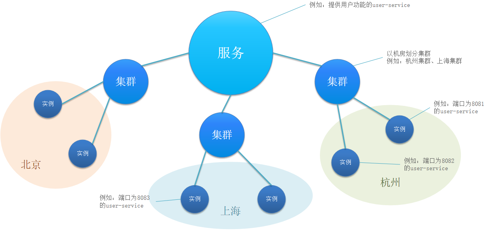
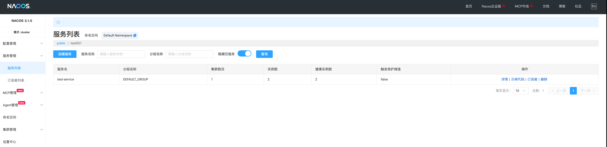
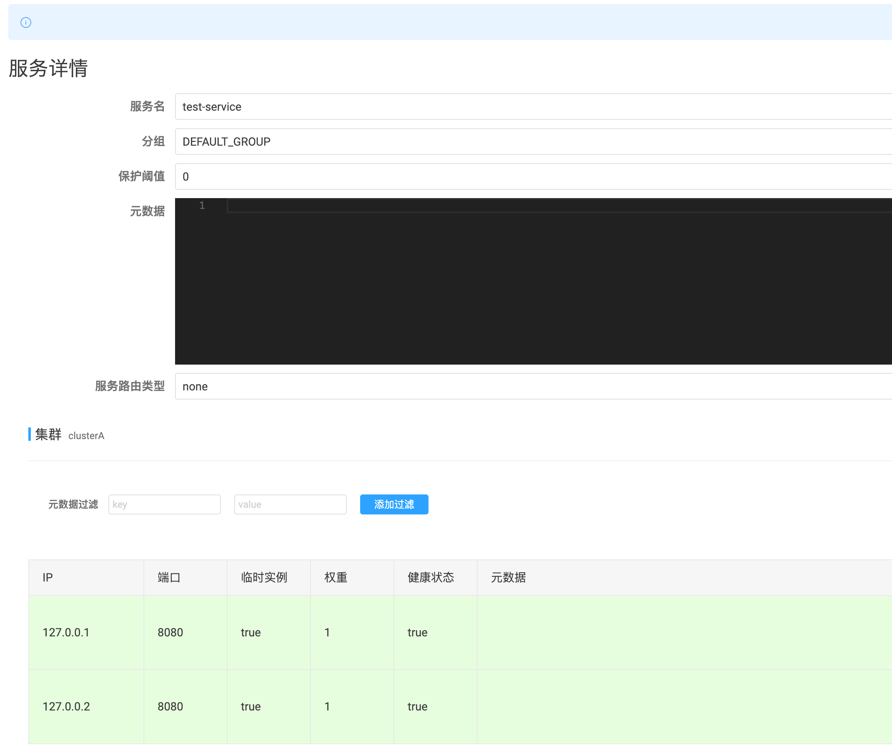
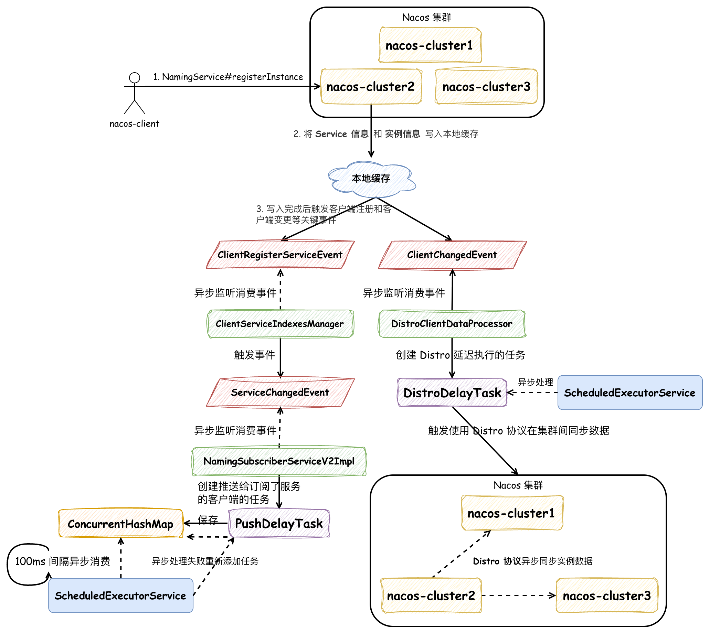
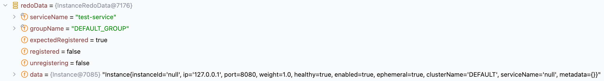
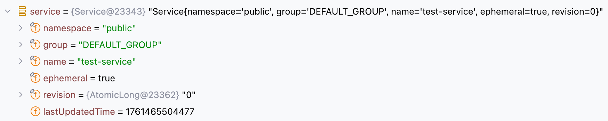

## Nacos 源码深度畅游：注册中心核心流程详解

本篇文章我们来了解一下 Nacos 另一大功能：注册中心。本文会先介绍一下 Nacos 注册中心的数据存储模型，让大家对 Nacos 注册中心有一个大致的理解，随后根据流程图简要介绍 Nacos 注册中心的核心流程，避免直接阅读源码时太过晦涩，并让大家对 Nacos 注册中心有一个基本的了解，随后阅读这一部分源码能让大家对分布式服务或注册中心有一个更好的认识，更好的理解 CP 或 AP 定理；注册中心内对数据一致性的保证；以及复杂流程中如何将各个操作解耦并不使操作丢失等等，以辅助大家日后的系统设计。

---

Nacos 的注册中心服务将服务的注册信息的 **存储模型** 分为三级，如下图所示：



1. 一级是 **服务**：例如系统的微服务划分，提供用户服务的 `user-service`，服务的类定义在 Nacos 中是 `com.alibaba.nacos.naming.core.v2.pojo.Service`
2. 二级是 **集群**：比如可以按区域机房划分集群，北京集群、上海集群、广州集群等等，集群在 Nacos 中没有专门的类定义，使用 `clusterName` 识别
3. 三级是 **实例**：例如北京机房的某台服务器部署的某个实例，实例的类定义在 Nacos 中是 `com.alibaba.nacos.api.naming.pojo.Instance`

如果我们向 `test-server` 服务下，集群为 `clusterA` 下注册两个实例时（默认 public 的命名空间），在控制台查询实例信息时如下所示：





在服务详情中会展示这个集群下所有的实例信息。在深入分析源码之前，我们还是根据流程图简述一下 Nacos 作为注册中心时，注册实例信息的核心流程： 



首先，Nacos Client 会对 Nacos Server 集群中某一个节点发送 gRPC 请求进行实例注册；服务端处理客户端请求时，会先将 **Service 信息** 和 **实例信息** 写入本地缓存，并触发 `ClientRegisterServiceEvent` 和 `ClientChangedEvent` 两个事件。

`ClientRegisterServiceEvent` 事件的作用是创建推送给订阅了服务的客户端的任务，在 `ScheduledExecutorService` 中定时异步执行，并且有失败重试机制，保证客户端及时接收到注册实例发生变更的数据。

`ClientChangedEvent` 事件的作用是创建延迟执行 Distro 协议数据同步的任务，同样也是依赖 `ScheduledExecutorService` 延迟执行。**Distro 协议是 Nacos 中专门用于处理临时实例数据一致性的分布式协议**，它保证集群内数据一致性的方法非常简单，由接收到实例注册信息的节点将数据异步发送给集群内其他节点，其他节点会向该节点一样执行一次实例注册的流程。能通过这么简单的方式来完成数据同步，因为以下原因：

1. **服务注册数据模型的属性简化了分布式一致性问题，避免了复杂的冲突解决机制**：**服务实例通过多个维度确定唯一性**：命名空间 + 服务名 + 集群名 + IP地址 + 端口号，这种唯一性设计确保了同一个服务实例的注册信息在任何节点都是相同的，所以同一实例的注册信息在不同节点、不同时间先后写入都不会存在数据冲突问题，**写入操作是幂等的**，大大降低了保证数据一致性的复杂度
2. 服务实例的注册信息是 **临时数据**：数据具有生命周期，会自动过期或被清理，不需要持久化存储，丢失后可以重新生成，降低了维护实例数据的难度
3. 业务场景能够接受数据的 **最终一致性**：可用性（Availability）比一致性（Consistency）更重要，短时间内部分实例注册信息不一致不影响业务
4. 多个 Nacos Client 客户端会连接到不同的 Nacos Server 服务端，相当于进行了 **分片**：每个服务节点负责特定的客户端实例，客户端注册的操作基本只在一个服务节点发生，大大降低了发生写入冲突的可能

所以 Distro 协议才能如此简单和高效，保证 Nacos 集群内注册实例信息的 **最终一致性**。以上便是在 Nacos 注册中心注册实例的大致流程，做了一些省略，但是主要的原理没有改变：同步写入本地缓存记录服务和实例信息，异步处理事件执行客户端的订阅推送和 Distro 协议的数据同步，保证集群内实例信息的数据一致性，如果大家想深入到源码的细节中，欢迎阅读以下内容。

### 源码分析

以如下源码来作为注册服务实例的入口来验证向 Nacos 注册中心注册服务实例的逻辑：

```java
public class TestNaming {
    @Test
    void testNacosNamingService() throws InterruptedException, NacosException {
        Properties properties = new Properties();
        properties.put(PropertyKeyConst.SERVER_ADDR, "127.0.0.1:8848");
        properties.put(PropertyKeyConst.NAMESPACE, "public");
        NamingService namingService = NacosFactory.createNamingService(properties);

        try {
            // 注册一个服务实例
            namingService.registerInstance("test-service", "127.0.0.1", 8080, "clusterA");

            // 添加事件监听器
            namingService.subscribe("test-service", event -> System.out.println("服务实例变化: " + event));
        } catch (Exception e) {
            System.out.println("服务注册失败(预期，因为服务器可能未启动): " + e.getMessage());
        }

        TimeUnit.HOURS.sleep(5);

        namingService.shutDown();
    }
}
```

最先它会执行 `NamingService#registerInstance` 方法，`Instance` 对象便是存储模型的实例信息：

```java
public class NacosNamingService implements NamingService {

    private NamingClientProxy clientProxy;
    
    @Override
    public void registerInstance(String serviceName, String groupName, String ip, int port, String clusterName)
            throws NacosException {
        Instance instance = new Instance();
        instance.setIp(ip);
        instance.setPort(port);
        // 默认权重值为 1
        instance.setWeight(1.0);
        instance.setClusterName(clusterName);
        registerInstance(serviceName, groupName, instance);
    }

    @Override
    public void registerInstance(String serviceName, String groupName, Instance instance) throws NacosException {
        // 参数校验
        NamingUtils.checkInstanceIsLegal(instance);
        checkAndStripGroupNamePrefix(instance, groupName);
        // 在这里实际上使用了静态代理模式来区分是使用 HTTPClient 还是 GrpcClient，默认为后者
        clientProxy.registerService(serviceName, groupName, instance);
    }
}
```

实际执行注册的为 `NamingGrpcClientProxy` 实现类，在向注册中心注册服务的逻辑中，我们 **只关注创建临时（Ephemeral）服务实例** 的逻辑：

```java
public class NamingGrpcClientProxy extends AbstractNamingClientProxy {

    private final NamingGrpcRedoService redoService;
    
    @Override
    public void registerService(String serviceName, String groupName, Instance instance) throws NacosException {
        NAMING_LOGGER.info("[REGISTER-SERVICE] {} registering service {} with instance {}", namespaceId, serviceName,
                instance);
        // [registerInstance] 步骤1：创建服务实例区分是否为临时
        if (instance.isEphemeral()) { 
            registerServiceForEphemeral(serviceName, groupName, instance);
        } else {
            doRegisterServiceForPersistent(serviceName, groupName, instance);
        }
    }

    private void registerServiceForEphemeral(String serviceName, String groupName, Instance instance)
            throws NacosException {
        redoService.cacheInstanceForRedo(serviceName, groupName, instance);
        doRegisterService(serviceName, groupName, instance);
    }

    public void doRegisterService(String serviceName, String groupName, Instance instance) throws NacosException {
        // 客户端创建注册实例请求对象，包含命名空间、服务名、分组名和实例信息
        InstanceRequest request = new InstanceRequest(namespaceId, serviceName, groupName,
                NamingRemoteConstants.REGISTER_INSTANCE, instance);
        // [registerInstance] 步骤2：通过gRPC协议向服务端发送注册请求
        requestToServer(request, Response.class);
        redoService.instanceRegistered(serviceName, groupName);
    }
}
```

在上述步骤中，可以发现分别两次调用了 `redoServer` 的 `cacheInstanceForRedo` 和 `instanceRegistered` 方法：

```java
public class NamingGrpcRedoService implements ConnectionEventListener {

    private final ConcurrentMap<String, InstanceRedoData> registeredInstances = new ConcurrentHashMap<>();
    
    // 创建 InstanceRedoData 对象在 ConcurrentMap 中
    public void cacheInstanceForRedo(String serviceName, String groupName, Instance instance) {
        // eg: DEFAULT_GROUP@@test-service
        String key = NamingUtils.getGroupedName(serviceName, groupName);
        InstanceRedoData redoData = InstanceRedoData.build(serviceName, groupName, instance);
        synchronized (registeredInstances) {
            registeredInstances.put(key, redoData);
        }
    }
}
```

首先它会创建 `InstanceRedoData` 对象保存在 `ConcurrentMap` 中，初始字段值如下：



在成功调用向服务端注册实例后，会将 `InstanceRedoData#registered` 字段标记为 true：

```java
public class NamingGrpcRedoService implements ConnectionEventListener {

    private final ConcurrentMap<String, InstanceRedoData> registeredInstances = new ConcurrentHashMap<>();
    
    public void instanceRegistered(String serviceName, String groupName) {
        String key = NamingUtils.getGroupedName(serviceName, groupName);
        synchronized (registeredInstances) {
            InstanceRedoData redoData = registeredInstances.get(key);
            if (null != redoData) {
                // 标记 registered 字段为 true
                redoData.registered();
            }
        }
    }
}
```

至于 `InstanceRedoData` 对象有什么作用我们之后再看，我们还是先回到 gRPC 请求服务端注册实例的逻辑中。Nacos Client 会向服务端发送 `InstanceRequest` 请求，并有 Nacos Server 端的 `InstanceRequestHandler` 承接：

```java
@Component
public class InstanceRequestHandler extends RequestHandler<InstanceRequest, InstanceResponse> {

    private final EphemeralClientOperationServiceImpl clientOperationService;

    public InstanceRequestHandler(EphemeralClientOperationServiceImpl clientOperationService) {
        this.clientOperationService = clientOperationService;
    }

    @Override
    @NamespaceValidation
    @TpsControl(pointName = "RemoteNamingInstanceRegisterDeregister", name = "RemoteNamingInstanceRegisterDeregister")
    @Secured(action = ActionTypes.WRITE)
    @ExtractorManager.Extractor(rpcExtractor = InstanceRequestParamExtractor.class)
    public InstanceResponse handle(InstanceRequest request, RequestMeta meta) throws NacosException {
        // [registerInstance] 步骤3：根据请求参数创建服务对象，设置为ephemeral（临时）服务
        Service service = Service.newService(request.getNamespace(), request.getGroupName(), request.getServiceName(),
                true);
        InstanceUtil.setInstanceIdIfEmpty(request.getInstance(), service.getGroupedServiceName());
        switch (request.getType()) {
            case NamingRemoteConstants.REGISTER_INSTANCE:
                // 根据请求类型分发到具体的注册实例方法
                return registerInstance(service, request, meta);
            case NamingRemoteConstants.DE_REGISTER_INSTANCE:
                return deregisterInstance(service, request, meta);
            default:
                throw new NacosException(NacosException.INVALID_PARAM,
                        String.format("Unsupported request type %s", request.getType()));
        }
    }

    private InstanceResponse registerInstance(Service service, InstanceRequest request, RequestMeta meta)
            throws NacosException {
        // 调用客户端操作服务注册实例，传入服务、实例和连接ID
        clientOperationService.registerInstance(service, request.getInstance(), meta.getConnectionId());
        // 发布实例注册跟踪事件，记录注册操作的详细信息
        NotifyCenter.publishEvent(new RegisterInstanceTraceEvent(System.currentTimeMillis(),
                NamingRequestUtil.getSourceIpForGrpcRequest(meta), true, service.getNamespace(), service.getGroup(),
                service.getName(), request.getInstance().getIp(), request.getInstance().getPort()));
        return new InstanceResponse(NamingRemoteConstants.REGISTER_INSTANCE);
    }
}
```

它会创建 `Service` 对象，它是存储模型中的服务信息，如下所示：



接下来我们先深入到其中调用的 `EphemeralClientOperationServiceImpl#registerInstance` 方法中：

```java
public class EphemeralClientOperationServiceImpl implements ClientOperationService {
    @Override
    public void registerInstance(Service service, Instance instance, String clientId) throws NacosException {
        // 验证实例的合法性（IP、端口等）
        NamingUtils.checkInstanceIsLegal(instance);

        // [registerInstance] 步骤4：从服务管理器获取单例服务对象
        Service singleton = ServiceManager.getInstance().getSingleton(service);
        if (!singleton.isEphemeral()) {
            throw new NacosRuntimeException(NacosException.INVALID_PARAM,
                    String.format("Current service %s is persistent service, can't register ephemeral instance.",
                            singleton.getGroupedServiceName()));
        }
        // 获取客户端连接对象并验证其合法性
        Client client = clientManager.getClient(clientId);
        checkClientIsLegal(client, clientId);
        // 将实例信息转换为发布信息对象
        InstancePublishInfo instanceInfo = getPublishInfo(instance);
        // [registerInstance] 步骤5：将实例信息 InstancePublishInfo 添加到客户端的服务实例列表中
        client.addServiceInstance(singleton, instanceInfo);
        client.setLastUpdatedTime();
        client.recalculateRevision();
        // 发布客户端注册服务事件
        NotifyCenter.publishEvent(new ClientOperationEvent(singleton, clientId));
        // 发布实例元数据事件，完成注册流程
        NotifyCenter
                .publishEvent(new MetadataEvent.InstanceMetadataEvent(singleton, instanceInfo.getMetadataId(), false));
    }
}

public class ServiceManager {

    // 单例模式：饿汉式
    private static final ServiceManager INSTANCE = new ServiceManager();
    
    public static ServiceManager getInstance() {
        return INSTANCE;
    }


    private final ConcurrentHashMap<Service, Service> singletonRepository;

    private final ConcurrentHashMap<String, Set<Service>> namespaceSingletonMaps;

    private ServiceManager() {
        singletonRepository = new ConcurrentHashMap<>(1 << 10);
        namespaceSingletonMaps = new ConcurrentHashMap<>(1 << 2);
    }
    
    public Service getSingleton(Service service) {
        // 首先在 singletonRepository 中查找或创建服务单例
        Service result = singletonRepository.computeIfAbsent(service, key -> {
            NotifyCenter.publishEvent(new MetadataEvent.ServiceMetadataEvent(service, false));
            return service;
        });
        // [registerInstance] 关键数据写入：将服务添加到命名空间服务映射表中 namespaceSingletonMaps
        namespaceSingletonMaps.computeIfAbsent(result.getNamespace(), namespace -> new ConcurrentHashSet<>()).add(result);
        return result;
    }
}
```

在 **[registerInstance] 步骤4** 中完成了 **服务实例信息注册后本地缓存的写入**，它会被记录到 `ServiceManager#singletonRepository` 和 `ServiceManager#namespaceSingletonMaps` 两个变量中，并且在在首次通过 `ConcurrentHashMap#computeIfAbsent` 方法添加时会触发 `ServiceMetadataEvent` 事件，这个事件用于更新服务信息的元数据，比较简单就不再解释了，这有一点 **代码规范** 需要注意：它将 `ServiceManager#getSingleton` 命名为获取服务实例的方法，但是却在这个 `get` 方法中执行了写入逻辑，具有迷惑性，应该修改命名为 `registerAndGetSingleton` 才对。再回到 `registerInstance` 方法中，**[registerInstance] 步骤5** 也是一段重要的逻辑，它会在 `ConcurrentHashMap<Service, InstancePublishInfo> publishers` 记录注册实例的发布信息 `InstancePublishInfo`，包含 **实例的 IP，端口和集群等必要信息**，后续会从发布信息中来获取这些字段值，并且会触发 `ClientChangedEvent` 事件：

```java
public abstract class AbstractClient implements Client {

    protected final ConcurrentHashMap<Service, InstancePublishInfo> publishers = new ConcurrentHashMap<>(16, 0.75f, 1);
    
    @Override
    public boolean addServiceInstance(Service service, InstancePublishInfo instancePublishInfo) {
        if (instancePublishInfo instanceof BatchInstancePublishInfo) {
            InstancePublishInfo old = publishers.put(service, instancePublishInfo);
            MetricsMonitor.incrementIpCountWithBatchRegister(old, (BatchInstancePublishInfo) instancePublishInfo);
        } else {
            // 记录实例的发布信息，用于后续从发布信息中解析获取注册实例的 IP 信息等
            if (null == publishers.put(service, instancePublishInfo)) {
                MetricsMonitor.incrementInstanceCount();
            }
        }
        // 触发 ClientChangedEvent 事件
        NotifyCenter.publishEvent(new ClientEvent.ClientChangedEvent(this));
        Loggers.SRV_LOG.info("Client change for service {}, {}", service, getClientId());
        return true;
    }
}
```

在 `registerInstance` 方法中还会发布两个事件：`ClientRegisterServiceEvent` 和 `InstanceMetadataEvent`，后者用于写入实例的元数据比较简单，就不再赘述了。在以上逻辑中，我们知道了服务信息 `Service` 被记录在了 `ServiceManager` 中，服务下实例的信息被保存在了 `AbstractClient#publishers` 字段中，接下来我们看 `ClientRegisterServiceEvent` 事件和 `ClientChangedEvent` 事件是如何被处理的。

#### ClientRegisterServiceEvent

`ClientRegisterServiceEvent` 事件由 `ClientServiceIndexesManager` 订阅并消费，在这里也会记录服务信息，如下方代码所示，它还会触发 `ServiceChangedEvent` 事件：

```java
@Component
public class ClientServiceIndexesManager extends SmartSubscriber {

    private final ConcurrentMap<Service, Set<String>> publisherIndexes = new ConcurrentHashMap<>();
    
    private void handleClientOperation(ClientOperationEvent event) {
        Service service = event.getService();
        String clientId = event.getClientId();
        if (event instanceof ClientOperationEvent.ClientRegisterServiceEvent) {
            // [registerInstance] 步骤6：处理客户端注册服务事件，将服务和客户端ID添加到发布者索引 publisherIndexes 中
            addPublisherIndexes(service, clientId);
        } else if (event instanceof ClientOperationEvent.ClientDeregisterServiceEvent) {
            removePublisherIndexes(service, clientId);
        } else if (event instanceof ClientOperationEvent.ClientSubscribeServiceEvent) {
            addSubscriberIndexes(service, clientId);
        } else if (event instanceof ClientOperationEvent.ClientUnsubscribeServiceEvent) {
            removeSubscriberIndexes(service, clientId);
        }
    }

    private void addPublisherIndexes(Service service, String clientId) {
        String serviceChangedType = Constants.ServiceChangedType.INSTANCE_CHANGED;
        if (!publisherIndexes.containsKey(service)) {
            // 唯一需要更新索引的时间是 "首次" 创建服务的时
            serviceChangedType = Constants.ServiceChangedType.ADD_SERVICE;
        }
        // 发布服务变更事件，通知订阅者有新的服务实例注册
        NotifyCenter.publishEvent(new ServiceEvent.ServiceChangedEvent(service, serviceChangedType, true));
        publisherIndexes.computeIfAbsent(service, key -> new ConcurrentHashSet<>()).add(clientId);
    }
}
```

`ServiceChangedEvent` 事件被 `NamingSubscriberServiceV2Impl` 订阅并消费：

```java
public class NamingSubscriberServiceV2Impl extends SmartSubscriber implements NamingSubscriberService {

    private final PushDelayTaskExecuteEngine delayTaskEngine;
    
    @Override
    public void onEvent(Event event) {
        if (event instanceof ServiceEvent.ServiceChangedEvent) {
            // [registerInstance] 步骤7：处理服务变更事件，创建推送任务将服务变更通知给所有订阅者
            ServiceEvent.ServiceChangedEvent serviceChangedEvent = (ServiceEvent.ServiceChangedEvent) event;
            Service service = serviceChangedEvent.getService();
            delayTaskEngine.addTask(service, new PushDelayTask(service, PushConfig.getInstance().getPushTaskDelay()));
            MetricsMonitor.incrementServiceChangeCount(service);
        }
    }
}
```

它会创建一个 `PushDelayTask` 添加到 `NacosDelayTaskExecuteEngine#tasks` 中，这个 `NacosDelayTaskExecuteEngine` 我们在配置发布的章节介绍过，本质上它是一个 `ScheduledExecutorService` 在每 100ms 执行一个 `ConcurrentHashMap<Object, AbstractDelayTask> tasks` 的任务。接下来我们先来了解一下 `PushDelayTask` 任务，重点关注注释信息：

```java
public class PushDelayTask extends AbstractDelayTask {

    private final Service service;

    // 是否推送给所有订阅服务信息的 Client
    private boolean pushToAll;

    private Set<String> targetClients;

    // 创建推送所有订阅者的任务，上文中便是调用的这个构造函数
    public PushDelayTask(Service service, long delay) {
        this.service = service;
        pushToAll = true;
        targetClients = null;
        setTaskInterval(delay);
        setLastProcessTime(System.currentTimeMillis());
    }

    // 创建推送某一个订阅者的任务，专门用于处理某个 IP 推送失败的情况
    public PushDelayTask(Service service, long delay, String targetClient) {
        this.service = service;
        this.pushToAll = false;
        this.targetClients = new HashSet<>(1);
        this.targetClients.add(targetClient);
        setTaskInterval(delay);
        setLastProcessTime(System.currentTimeMillis());
    }

    // 合并任务，避免多次重复调用
    @Override
    public void merge(AbstractDelayTask task) {
        if (!(task instanceof PushDelayTask)) {
            return;
        }
        PushDelayTask oldTask = (PushDelayTask) task;
        if (isPushToAll() || oldTask.isPushToAll()) {
            pushToAll = true;
            targetClients = null;
        } else {
            targetClients.addAll(oldTask.getTargetClients());
        }
        setLastProcessTime(Math.min(getLastProcessTime(), task.getLastProcessTime()));
        Loggers.PUSH.info("[PUSH] Task merge for {}", service);
    }

    public Service getService() {
        return service;
    }

    public boolean isPushToAll() {
        return pushToAll;
    }

    // 获取目标推送 Client
    public Set<String> getTargetClients() {
        return targetClients;
    }
}
```

我们能了解到 `PushDelayTask` 能够 **区分是推送给所有客户端还是只推送单一客户端，这么做的目的是可以针对某些推送异常的客户端进行任务重试**。随后 `PushDelayTask` 会被 `PushDelayTaskProcessor` 处理，会被封装到 `PushExecuteTask` 任务中：

```java
private static class PushDelayTaskProcessor implements NacosTaskProcessor {
    
    private final PushDelayTaskExecuteEngine executeEngine;
    
    public PushDelayTaskProcessor(PushDelayTaskExecuteEngine executeEngine) {
        this.executeEngine = executeEngine;
    }
    
    @Override
    public boolean process(NacosTask task) {
        PushDelayTask pushDelayTask = (PushDelayTask) task;
        Service service = pushDelayTask.getService();
        // [registerInstance] 步骤8：分发推送任务到执行器，准备将服务变更推送给客户端
        NamingExecuteTaskDispatcher.getInstance()
                .dispatchAndExecuteTask(service, new PushExecuteTask(service, executeEngine, pushDelayTask));
        return true;
    }
}
```

`NamingExecuteTaskDispatcher#dispatchAndExecuteTask` 方法会执行到如下逻辑中，分配给某一条线程去处理：

```java
public class NacosExecuteTaskExecuteEngine extends AbstractNacosTaskExecuteEngine<AbstractExecuteTask> {

    // 本质上是多条线程
    private final TaskExecuteWorker[] executeWorkers;

    public NacosExecuteTaskExecuteEngine(String name, Logger logger, int dispatchWorkerCount) {
        super(logger);
        executeWorkers = new TaskExecuteWorker[dispatchWorkerCount];
        for (int mod = 0; mod < dispatchWorkerCount; ++mod) {
            executeWorkers[mod] = new TaskExecuteWorker(name, mod, dispatchWorkerCount, getEngineLog());
        }
    }
    
    @Override
    public void addTask(Object tag, AbstractExecuteTask task) {
        NacosTaskProcessor processor = getProcessor(tag);
        if (null != processor) {
            processor.process(task);
            return;
        }
        // 分配给某个线程处理
        TaskExecuteWorker worker = getWorker(tag);
        worker.process(task);
    }

    private TaskExecuteWorker getWorker(Object tag) {
        int idx = (tag.hashCode() & Integer.MAX_VALUE) % workersCount();
        return executeWorkers[idx];
    }
}
```

以上逻辑还未涉及 `PushExecuteTask` 推送服务变更的逻辑处理，大家只需要了解到，至此将推送任务转交到了某个单一的线程中去执行了，接下来我们看一下 `PushExecuteTask` 的具体逻辑：

```java
public class PushExecuteTask extends AbstractExecuteTask {

    private final PushDelayTaskExecuteEngine delayTaskEngine;

    private final PushDelayTask delayTask;
    
    @Override
    public void run() {
        try {
            // [registerInstance] 步骤9：生成推送数据，包含服务实例信息和元数据
            PushDataWrapper wrapper = generatePushData();
            ClientManager clientManager = delayTaskEngine.getClientManager();
            // 遍历目标客户端，向订阅了该服务的客户端推送数据
            for (String each : getTargetClientIds()) {
                Client client = clientManager.getClient(each);
                if (null == client) {
                    // means this client has disconnect
                    continue;
                }
                Subscriber subscriber = client.getSubscriber(service);
                // skip if null
                if (subscriber == null) {
                    continue;
                }
                // 通过推送执行器向客户端推送服务变更通知
                delayTaskEngine.getPushExecutor().doPushWithCallback(each, subscriber, wrapper,
                        new ServicePushCallback(each, subscriber, wrapper.getOriginalData(), delayTask.isPushToAll()));
            }
        } catch (Exception e) {
            Loggers.PUSH.error("Push task for service" + service.getGroupedServiceName() + " execute failed ", e);
            // 异常重试
            delayTaskEngine.addTask(service, new PushDelayTask(service, 1000L));
        }
    }

    // 初始推送时获取所有订阅服务信息的 Client；如果不是推送所有，说明是处理失败重试的场景，则只推送目标 Client 即可
    private Collection<String> getTargetClientIds() {
        return delayTask.isPushToAll() ? delayTaskEngine.getIndexesManager().getAllClientsSubscribeService(service)
                : delayTask.getTargetClients();
    }

    private class ServicePushCallback implements NamingPushCallback {
        @Override
        public void onSuccess() {
            // monitor and log
        }

        @Override
        public void onFail(Throwable e) {
            long pushCostTime = System.currentTimeMillis() - executeStartTime;
            if (!(e instanceof NoRequiredRetryException)) {
                Loggers.PUSH.error("Reason detail: ", e);
                // 如果针对某个 IP 推送失败，则创建推送针对目标 IP 的任务重试推送
                delayTaskEngine.addTask(service,
                        new PushDelayTask(service, PushConfig.getInstance().getPushTaskRetryDelay(), clientId));
            }
            PushResult result = PushResult
                    .pushFailed(service, clientId, actualServiceInfo, subscriber, pushCostTime, e, isPushToAll);
            PushResultHookHolder.getInstance().pushFailed(result);
        }
    }

}
```

从以上逻辑中可知：服务注册信息将推送给每个订阅了这个服务的 Client，如果推送失败会重新添加 `PushDelayTask` 任务重试，以此来保证订阅服务实例信息的 Client 都接收到变更。需要注意的是在 **[registerInstance] 步骤9** 中有以下非常关键的逻辑：

```java
public class PushExecuteTask extends AbstractExecuteTask {

    private final PushDelayTaskExecuteEngine delayTaskEngine;
    
    // 生成推送请求信息
    private PushDataWrapper generatePushData() {
        // 获取要推送的服务信息，包含实例信息
        ServiceInfo serviceInfo = delayTaskEngine.getServiceStorage().getPushData(service);
        ServiceMetadata serviceMetadata = delayTaskEngine.getMetadataManager().getServiceMetadata(service).orElse(null);
        return new PushDataWrapper(serviceMetadata, serviceInfo);
    }
}

@Component
public class ServiceStorage {

    private final ConcurrentMap<Service, Set<String>> serviceClusterIndex;
    
    public ServiceInfo getPushData(Service service) {
        ServiceInfo result = emptyServiceInfo(service);
        if (!ServiceManager.getInstance().containSingleton(service)) {
            return result;
        }
        Service singleton = ServiceManager.getInstance().getSingleton(service);
        result.setHosts(getAllInstancesFromIndex(singleton));
        serviceDataIndexes.put(singleton, result);
        return result;
    }

    private ServiceInfo emptyServiceInfo(Service service) {
        ServiceInfo result = new ServiceInfo();
        result.setName(service.getName());
        result.setGroupName(service.getGroup());
        result.setLastRefTime(System.currentTimeMillis());
        result.setCacheMillis(switchDomain.getDefaultPushCacheMillis());
        return result;
    }

    // 获取服务下所有的实例信息
    private List<Instance> getAllInstancesFromIndex(Service service) {
        Set<Instance> result = new HashSet<>();
        Set<String> clusters = new HashSet<>();
        // 获取 ClientId
        for (String each : serviceIndexesManager.getAllClientsRegisteredService(service)) {
            // 获取实例注册信息 InstancePublishInfo
            Optional<InstancePublishInfo> instancePublishInfo = getInstanceInfo(each, service);
            if (instancePublishInfo.isPresent()) {
                InstancePublishInfo publishInfo = instancePublishInfo.get();
                //If it is a BatchInstancePublishInfo type, it will be processed manually and added to the instance list
                if (publishInfo instanceof BatchInstancePublishInfo) {
                    BatchInstancePublishInfo batchInstancePublishInfo = (BatchInstancePublishInfo) publishInfo;
                    List<Instance> batchInstance = parseBatchInstance(service, batchInstancePublishInfo, clusters);
                    result.addAll(batchInstance);
                } else {
                    // 根据请求时 InstancePublishInfo 的注册实例对象创建出 Instance 实例
                    Instance instance = parseInstance(service, instancePublishInfo.get());
                    result.add(instance);
                    clusters.add(instance.getClusterName());
                }
            }
        }
        // 缓存记录这个服务的集群
        serviceClusterIndex.put(service, clusters);
        return new LinkedList<>(result);
    }
}
```

在 `generatePushData` 方法中，生成了 `ServiceInfo` 对象，其中包含服务和该服务下注册的所有实例，实例信息是从 `InstancePublishInfo` 中解析出来的，实例的发布信息我们在上文中提到过。除此之外，还需要注意在 `getAllInstancesFromIndex` **读方法中包含了缓存写入的逻辑**，这种写法是非常不推荐的，具有迷惑性：谁会想到在读方法中还会包含写逻辑呢？所以在日常开发中一定要避免这种写法！

总结一下：`ClientRegisterServiceEvent` 事件的作用是将服务实例的变更信息推送给订阅了这个服务的所有客户端。

#### ClientChangedEvent

`ClientChangedEvent` 事件会被 `DistroClientDataProcessor` 订阅并消费，在它的 `onEvent` 方法中的 `else` 逻辑中可以发现它调用了 `syncToAllServer` 方法，从方法名中可以大概能猜出来，在 Nacos 采用集群模式部署时，会通过这个方法将注册的服务信息同步到其他节点上：

```java
public class DistroClientDataProcessor extends SmartSubscriber implements DistroDataStorage, DistroDataProcessor {

    private final DistroProtocol distroProtocol;
    
    @Override
    public void onEvent(Event event) {
        if (EnvUtil.getStandaloneMode()) {
            return;
        }
        if (event instanceof ClientEvent.ClientVerifyFailedEvent) {
            syncToVerifyFailedServer((ClientEvent.ClientVerifyFailedEvent) event);
        } else {
            // [registerInstance] 步骤10：同步所有服务
            syncToAllServer((ClientEvent) event);
        }
    }

    private void syncToAllServer(ClientEvent event) {
        Client client = event.getClient();
        if (isInvalidClient(client)) {
            return;
        }
        // 区分客户端断开连接的事件客户端变更事件
        if (event instanceof ClientEvent.ClientDisconnectEvent) {
            DistroKey distroKey = new DistroKey(client.getClientId(), TYPE);
            distroProtocol.sync(distroKey, DataOperation.DELETE);
        } else if (event instanceof ClientEvent.ClientChangedEvent) {
            DistroKey distroKey = new DistroKey(client.getClientId(), TYPE);
            distroProtocol.sync(distroKey, DataOperation.CHANGE);
        }
    }
}
```

在这个方法中，可以发现调用了 `DistroProtocol#sync` 方法，`DistroProtocol` 表示 **Distro 协议**：**专门用于处理临时实例数据一致性的分布式协议**，接下来我们通过 Nacos 的逻辑来了解一下这个协议。在 `DistroProtocol#sync` 方法中：

```java
@Component
public class DistroProtocol {

    private final DistroTaskEngineHolder distroTaskEngineHolder;
    
    public void sync(DistroKey distroKey, DataOperation action) {
        sync(distroKey, action, DistroConfig.getInstance().getSyncDelayMillis());
    }

    public void sync(DistroKey distroKey, DataOperation action, long delay) {
        for (Member each : memberManager.allMembersWithoutSelf()) {
            syncToTarget(distroKey, action, each.getAddress(), delay);
        }
    }

    public void syncToTarget(DistroKey distroKey, DataOperation action, String targetServer, long delay) {
        DistroKey distroKeyWithTarget = new DistroKey(distroKey.getResourceKey(), distroKey.getResourceType(),
                targetServer);
        // 创建异步 DistroDelayTask 任务
        DistroDelayTask distroDelayTask = new DistroDelayTask(distroKeyWithTarget, action, delay);
        // 添加到任务列表中延迟执行
        distroTaskEngineHolder.getDelayTaskExecuteEngine().addTask(distroKeyWithTarget, distroDelayTask);
        if (Loggers.DISTRO.isDebugEnabled()) {
            Loggers.DISTRO.debug("[DISTRO-SCHEDULE] {} to {}", distroKey, targetServer);
        }
    }
}
```

它会创建一个 `DistroDelayTask` 添加到 `NacosDelayTaskExecuteEngine#tasks` 中，这个 `NacosDelayTaskExecuteEngine` 我们在配置发布的章节介绍过，本质上它是一个 `ScheduledExecutorService` 在每 100ms 执行一个 `ConcurrentHashMap<Object, AbstractDelayTask> tasks` 的任务。`DistroDelayTask` 任务中没有什么重要的逻辑，直接来看处理这个任务的实现类 `DistroDelayTaskProcessor`：

```java
public class DistroDelayTaskProcessor implements NacosTaskProcessor {
    private final DistroTaskEngineHolder distroTaskEngineHolder;

    private final DistroComponentHolder distroComponentHolder;

    public DistroDelayTaskProcessor(DistroTaskEngineHolder distroTaskEngineHolder,
                                    DistroComponentHolder distroComponentHolder) {
        this.distroTaskEngineHolder = distroTaskEngineHolder;
        this.distroComponentHolder = distroComponentHolder;
    }

    @Override
    public boolean process(NacosTask task) {
        if (!(task instanceof DistroDelayTask)) {
            return true;
        }
        DistroDelayTask distroDelayTask = (DistroDelayTask) task;
        DistroKey distroKey = distroDelayTask.getDistroKey();
        switch (distroDelayTask.getAction()) {
            case DELETE:
                DistroSyncDeleteTask syncDeleteTask = new DistroSyncDeleteTask(distroKey, distroComponentHolder);
                distroTaskEngineHolder.getExecuteWorkersManager().addTask(distroKey, syncDeleteTask);
                return true;
            case CHANGE:
            case ADD:
                // [registerInstance] 步骤11：创建 DistroSyncChangeTask 任务异步执行
                DistroSyncChangeTask syncChangeTask = new DistroSyncChangeTask(distroKey, distroComponentHolder);
                distroTaskEngineHolder.getExecuteWorkersManager().addTask(distroKey, syncChangeTask);
                return true;
            default:
                return false;
        }
    }
}
```

**[registerInstance] 步骤11** 会创建 `DistroSyncChangeTask` 任务同样添加到延迟执行的任务队列中等待处理，这个任务的逻辑我们先来看一下：

```java
public class DistroSyncChangeTask extends AbstractDistroExecuteTask {
    
    private static final DataOperation OPERATION = DataOperation.CHANGE;
    
    public DistroSyncChangeTask(DistroKey distroKey, DistroComponentHolder distroComponentHolder) {
        super(distroKey, distroComponentHolder);
    }
    
    @Override
    protected DataOperation getDataOperation() {
        return OPERATION;
    }
    
    @Override
    protected boolean doExecute() {
        String type = getDistroKey().getResourceType();
        DistroData distroData = getDistroData(type);
        if (null == distroData) {
            Loggers.DISTRO.warn("[DISTRO] {} with null data to sync, skip", toString());
            return true;
        }
        // gRPC 通知其他节点服务实例信息
        return getDistroComponentHolder().findTransportAgent(type).syncData(distroData, getDistroKey().getTargetServer());
    }
    
    @Override
    protected void doExecuteWithCallback(DistroCallback callback) {
        String type = getDistroKey().getResourceType();
        DistroData distroData = getDistroData(type);
        if (null == distroData) {
            Loggers.DISTRO.warn("[DISTRO] {} with null data to sync, skip", toString());
            return;
        }
        // gRPC 通知其他节点服务实例信息
        getDistroComponentHolder().findTransportAgent(type).syncData(distroData, getDistroKey().getTargetServer(), callback);
    }
    
    @Override
    public String toString() {
        return "DistroSyncChangeTask for " + getDistroKey().toString();
    }
    
    // 获取 Distro 要推送的数据
    private DistroData getDistroData(String type) {
        DistroData result = getDistroComponentHolder().findDataStorage(type).getDistroData(getDistroKey());
        if (null != result) {
            result.setType(OPERATION);
        }
        return result;
    }
}
```

它的源码很简短，主要关注 `doExecute` 和 `doExecuteWithCallback` 方法，这两个方法的逻辑是借助 gRPC 通知集群中其他节点，区别是是否在 gRPC 调用完成后执行回调函数，这个任务的执行是在 `NacosExecuteTaskExecuteEngine` 中异步执行的，因为在上文中讲解过就不再赘述了，失败重试采用的还是重新添加到任务队列中等待执行。除此之外我们也要弄清楚推送的 DistroData 中到底都包含哪些信息，如下代码所示，它会执行到 `AbstractClient#generateSyncData` 的逻辑中：

```java
public abstract class AbstractClient implements Client {
    // ...
    
    @Override
    public ClientSyncData generateSyncData() {
        List<String> namespaces = new LinkedList<>();
        List<String> groupNames = new LinkedList<>();
        List<String> serviceNames = new LinkedList<>();

        List<String> batchNamespaces = new LinkedList<>();
        List<String> batchGroupNames = new LinkedList<>();
        List<String> batchServiceNames = new LinkedList<>();

        List<InstancePublishInfo> instances = new LinkedList<>();
        List<BatchInstancePublishInfo> batchInstancePublishInfos = new LinkedList<>();
        BatchInstanceData  batchInstanceData = new BatchInstanceData();
        for (Map.Entry<Service, InstancePublishInfo> entry : publishers.entrySet()) {
            InstancePublishInfo instancePublishInfo = entry.getValue();
            if (instancePublishInfo instanceof BatchInstancePublishInfo) {
                BatchInstancePublishInfo batchInstance = (BatchInstancePublishInfo) instancePublishInfo;
                batchInstancePublishInfos.add(batchInstance);
                buildBatchInstanceData(batchInstanceData, batchNamespaces, batchGroupNames, batchServiceNames, entry);
                batchInstanceData.setBatchInstancePublishInfos(batchInstancePublishInfos);
            } else {
                namespaces.add(entry.getKey().getNamespace());
                groupNames.add(entry.getKey().getGroup());
                serviceNames.add(entry.getKey().getName());
                instances.add(entry.getValue());
            }
        }
        // 包含了命名空间、服务信息和实例信息（InstancePublishInfo 或 BatchInstanceData）等
        ClientSyncData data = new ClientSyncData(getClientId(), namespaces, groupNames, serviceNames, instances, batchInstanceData);
        data.getAttributes().addClientAttribute(REVISION, getRevision());
        return data;
    }
}
```

虽然比较长，只看注释相关的内容即可，推送内容包含了命名空间、服务信息和实例信息等，这些信息大部分都来自 `InstancePublishInfo`，可见这个对象多么重要。

`DistroSyncChangeTask` 任务会向其他节点发送 `DistroDataRequest` 请求，这个请求是如何被处理的呢？继续看 `DistroDataRequestHandler` 的逻辑：

```java
@InvokeSource(source = {RemoteConstants.LABEL_SOURCE_CLUSTER})
@Component
public class DistroDataRequestHandler extends RequestHandler<DistroDataRequest, DistroDataResponse> {

    private final DistroProtocol distroProtocol;

    public DistroDataRequestHandler(DistroProtocol distroProtocol) {
        this.distroProtocol = distroProtocol;
    }

    @Override
    @Secured(apiType = ApiType.INNER_API)
    public DistroDataResponse handle(DistroDataRequest request, RequestMeta meta) throws NacosException {
        try {
            switch (request.getDataOperation()) {
                case VERIFY:
                    return handleVerify(request.getDistroData(), meta);
                case SNAPSHOT:
                    return handleSnapshot();
                case ADD:
                case CHANGE:
                case DELETE:
                    // [registerInstance] 步骤12 处理 DistroDataRequest 请求
                    return handleSyncData(request.getDistroData());
                case QUERY:
                    return handleQueryData(request.getDistroData());
                default:
                    return new DistroDataResponse();
            }
        } catch (Exception e) {
            Loggers.DISTRO.error("[DISTRO-FAILED] distro handle with exception", e);
            DistroDataResponse result = new DistroDataResponse();
            result.setResultCode(ResponseCode.FAIL.getCode());
            result.setErrorCode(ResponseCode.FAIL.getCode());
            result.setMessage("handle distro request with exception");
            return result;
        }
    }

    private DistroDataResponse handleSyncData(DistroData distroData) {
        DistroDataResponse result = new DistroDataResponse();
        if (!distroProtocol.onReceive(distroData)) {
            result.setErrorCode(ResponseCode.FAIL.getCode());
            result.setMessage("[DISTRO-FAILED] distro data handle failed");
        }
        return result;
    }
}
```

我们需要关注 `DistroProtocol#onReceive` 方法：

```java
@Component
public class DistroProtocol {

    private final DistroComponentHolder distroComponentHolder;
    
    public boolean onReceive(DistroData distroData) {
        Loggers.DISTRO.info("[DISTRO] Receive distro data type: {}, key: {}", distroData.getType(),
                distroData.getDistroKey());
        String resourceType = distroData.getDistroKey().getResourceType();
        DistroDataProcessor dataProcessor = distroComponentHolder.findDataProcessor(resourceType);
        if (null == dataProcessor) {
            Loggers.DISTRO.warn("[DISTRO] Can't find data process for received data {}", resourceType);
            return false;
        }
        return dataProcessor.processData(distroData);
    }
}
```

它会执行到 `DistroClientDataProcessor#processData` 方法，其中的 `upgradeClient` 方法是关键：

```java
public class DistroClientDataProcessor extends SmartSubscriber implements DistroDataStorage, DistroDataProcessor {
    
    @Override
    public boolean processData(DistroData distroData) {
        switch (distroData.getType()) {
            case ADD:
            case CHANGE:
                // [registerInstance] 步骤12：处理 Distro 协议同步的数据
                ClientSyncData clientSyncData = ApplicationUtils.getBean(Serializer.class)
                        .deserialize(distroData.getContent(), ClientSyncData.class);
                handlerClientSyncData(clientSyncData);
                return true;
            case DELETE:
                String deleteClientId = distroData.getDistroKey().getResourceKey();
                Loggers.DISTRO.info("[Client-Delete] Received distro client sync data {}", deleteClientId);
                clientManager.clientDisconnected(deleteClientId);
                return true;
            default:
                return false;
        }
    }

    private void handlerClientSyncData(ClientSyncData clientSyncData) {
        Loggers.DISTRO
                .info("[Client-Add] Received distro client sync data {}, revision={}", clientSyncData.getClientId(),
                        clientSyncData.getAttributes().getClientAttribute(ClientConstants.REVISION, 0L));
        clientManager.syncClientConnected(clientSyncData.getClientId(), clientSyncData.getAttributes());
        Client client = clientManager.getClient(clientSyncData.getClientId());
        // upgrade 是升级的含义，实际逻辑是完成 Distro 数据的写入
        upgradeClient(client, clientSyncData);
    }

    private void upgradeClient(Client client, ClientSyncData clientSyncData) {
        Set<Service> syncedService = new HashSet<>();
        // process batch instance sync logic
        processBatchInstanceDistroData(syncedService, client, clientSyncData);
        List<String> namespaces = clientSyncData.getNamespaces();
        List<String> groupNames = clientSyncData.getGroupNames();
        List<String> serviceNames = clientSyncData.getServiceNames();
        List<InstancePublishInfo> instances = clientSyncData.getInstancePublishInfos();

        for (int i = 0; i < namespaces.size(); i++) {
            Service service = Service.newService(namespaces.get(i), groupNames.get(i), serviceNames.get(i));
            // 注册并获取服务信息
            Service singleton = ServiceManager.getInstance().getSingleton(service);
            syncedService.add(singleton);
            InstancePublishInfo instancePublishInfo = instances.get(i);
            if (!instancePublishInfo.equals(client.getInstancePublishInfo(singleton))) {
                // 执行的是 [registerInstance] 步骤5 的逻辑：将实例信息 InstancePublishInfo 添加到客户端的服务实例列表中
                client.addServiceInstance(singleton, instancePublishInfo);
                // 触发 ClientRegisterServiceEvent 事件
                NotifyCenter.publishEvent(
                        new ClientOperationEvent.ClientRegisterServiceEvent(singleton, client.getClientId()));
                NotifyCenter.publishEvent(
                        new MetadataEvent.InstanceMetadataEvent(singleton, instancePublishInfo.getMetadataId(), false));
            }
        }
        for (Service each : client.getAllPublishedService()) {
            if (!syncedService.contains(each)) {
                client.removeServiceInstance(each);
                NotifyCenter.publishEvent(
                        new ClientOperationEvent.ClientDeregisterServiceEvent(each, client.getClientId()));
            }
        }
        client.setRevision(clientSyncData.getAttributes().<Integer>getClientAttribute(ClientConstants.REVISION, 0));
    }
}
```

`DistroClientDataProcessor#upgradeClient` 方法会执行时就和开篇介绍的 `EphemeralClientOperationServiceImpl#registerInstance` 方法基本一致的逻辑，注册 `Service` 信息，写入实例信息 `InstancePublishInfo`，并在随后发布 `ClientRegisterServiceEvent` 事件，这个事件我们在上一个小节专门介绍过，它的作用是将服务实例的变更信息推送给订阅了这个服务的所有客户端。

总而言之，通过 Distro 协议同步数据给集群中其他节点相当于在其他节点重新执行了一次实例注册的逻辑。不过，大家有没有考虑过这个问题：为什么 Distro 协议能够通过如此简单的方式在服务发现场景下保证数据的最终一致性呢？

最主要的原因是：**服务注册数据模型的属性简化了分布式一致性问题，避免了复杂的冲突解决机制**。该如何理解这个特点呢？

- **服务实例通过多个维度确定唯一性**：命名空间 + 服务名 + 集群名 + IP地址 + 端口号，这种唯一性设计确保了同一个服务实例的注册信息在任何节点都是相同的，所以同一实例的注册信息在不同节点、不同时间先后写入都不会存在数据冲突问题，**写入操作是幂等的**，大大降低了保证数据一致性的复杂度。

理解了这一点，我觉得便清楚了 Distro 协议的精髓。此外，还有以下原因使得 Distro 协议适用：

1. 服务实例的注册信息是 **临时数据**：数据具有生命周期，会自动过期或被清理，不需要持久化存储，丢失后可以重新生成，降低了维护实例数据的难度
2. 业务场景能够接受数据的 **最终一致性**：可用性（Availability）比一致性（Consistency）更重要，短时间内部分实例注册信息不一致不影响业务
3. 多个 Nacos Client 客户端会连接到不同的 Nacos Server 服务端，相当于进行了 **分片**：每个服务节点负责特定的客户端实例，客户端注册的操作基本只在一个服务节点发生，大大降低了发生写入冲突的可能

接下来我们看一下在 Distro 协议中是如何清理过期数据的，核心逻辑在 `ExpiredClientCleaner` 中，它是一个定期执行的任务，任务逻辑如下：

```java
private static class ExpiredClientCleaner implements Runnable {

    private final EphemeralIpPortClientManager clientManager;
    
    @Override
    public void run() {
        long currentTime = System.currentTimeMillis();
        // 获取当前 Nacos Server 下连接的所有客户端
        for (String each : clientManager.allClientId()) {
            // 遍历处理客户端信息
            IpPortBasedClient client = (IpPortBasedClient) clientManager.getClient(each);
            // 如果客户端已经失效（在规定时间段内失去心跳）了
            if (null != client && isExpireClient(currentTime, client)) {
                // 执行客户端断开的逻辑，会触发 ClientDisconnectEvent 事件，删除失效的链接并通知集群内其他节点
                clientManager.clientDisconnected(each);
            }
        }
    }
}
```

这个定时任务会在 Nacos Server 启动时，在 `ScheduledExecutorService` 中定期 5s 执行一次：

```java
public class EphemeralIpPortClientManager implements ClientManager {
    public EphemeralIpPortClientManager(DistroMapper distroMapper, SwitchDomain switchDomain) {
        // 默认定期 5s 检查一次
        GlobalExecutor.scheduleExpiredClientCleaner(new ExpiredClientCleaner(this, switchDomain), 0,
                Constants.DEFAULT_HEART_BEAT_INTERVAL, TimeUnit.MILLISECONDS);
        // ...
    }
}
```

以此来保证过期的实例数据能及时被移除。

---

### 巨人的肩膀

- [Github - alibaba/nacos](https://github.com/alibaba/nacos)
- [博客园 - Nacos的基本使用（注册中心、配置中心）](https://www.cnblogs.com/wenxuehai/p/16179629.html)
